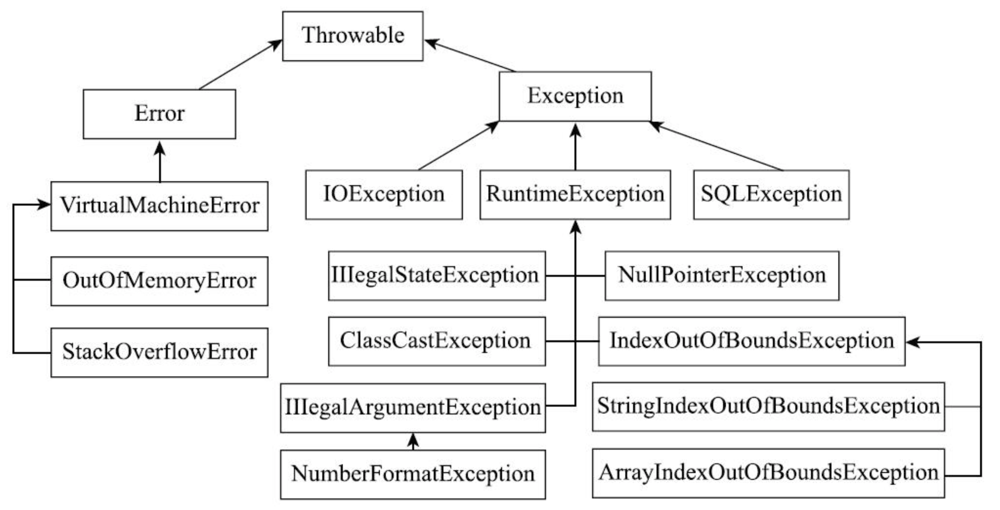
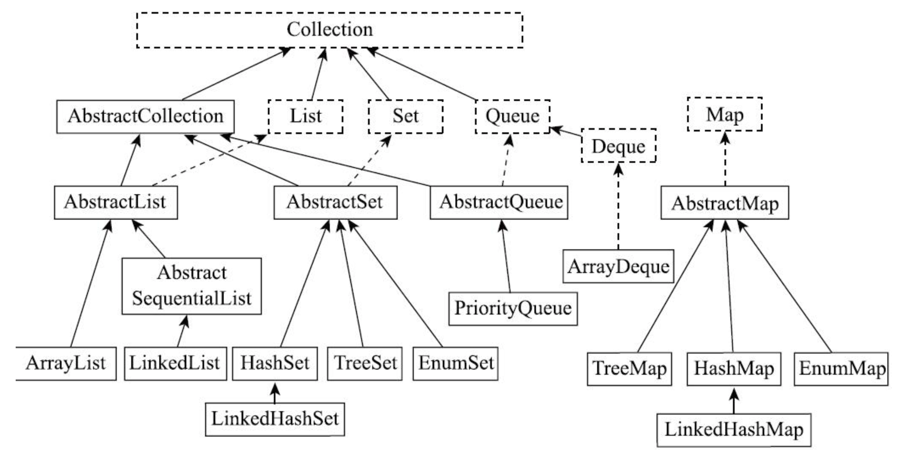

# Java编程逻辑

## 第一章

流程控制：

1. 条件执行
2. 循环

给数组中元素赋值是改变数组内容，而给数组变量赋值则会让变量指向一个不同位置

每条`case`语句后面都应该跟`break`语句，否则会继续执行后面`case`中的代码直到碰到`break`语句或者`switch`结束

单一条件满足时，执行某操作使用`if`；根据一个表达式是否满足执行不同分支使用`if/else`；表达式复杂的条件使用`if/else if/else`；条件赋值使用三元运算符，根据某一个表达式的值不同执行不同的分支使用`switch`

`String`是通过`hashCode`方法转换为整数的

条件执行本质依赖于条件跳转、无条件跳转和跳转表

计算机程序运行时大致只能顺序执行、条件执行和循环执行

## 第二章

对负数的补码做补码就是对应正整数的原码

移位：

1. 左移：向左移动，右边的低位补0，高位就舍弃
2. 无符号右移：向右移动，右边的舍弃掉，左边补0
3. 有符号右移：向右移动，右边的舍弃，左边原来是1就补1，是0就补0

需要比较高精度（不使用专门库时）的两种简单方法：

1. 将小数转换为整数进行运算；
2. 使用十进制的数据类型进行运算；

为了与ASCII保持兼容性，一般都是将最高位设置为1，也就是当最高位是0的时候表示ASCII码，当为1的时候表示各个国家自己的编码

编码转换的具体过程可以是：一个字符从A编码转到B编码，线找到字符的A编码，通过A的映射表找到Unicode编码，然后通过Unicode编号再查到B的映射表，找到字符B的编码格式

编码转换改变了字符的二进制内容，当并没有改变字符看上去的样子

`char`的本质上是一个固定占用两个字节的无符号正整数，这个正整数对应于Unicode编码，用于表示那个Unicode编号对应的字符

## 第三章

类更多表示的是自定义数据类型

实例方法和类方法的区别;

1. 类方法只能访问类变量，不能访问实例变量，可以调用其他的类方法，不能调用实例方法
2. 实例方法既能访问实例变量，也能访问类变量，既可以调用实例方法，也可以调用类方法

私有构造方法的场景：

1. 不能创建类的实例，类只能被静态的访问
2. 能创建类的实例，但只能被类的静态方法调用
3. 只是用来被其他多个构造方法调用，用于减少重复代码

类之间的组合在逻辑上，有两种不同的关系：

1. 包含
2. 单纯引用

`import`是编译时概念，用于确定完全限定名，在运行时，只根据完全限定名寻找并加载类

## 第四章

重写时，子类方法不能降低父类方法的可见性

每个对象除了保存类的实例变量之外，还保存着实际类信息的引用

寻找要执行的实例方法的时候，是从对象的实际类型信息开始查找的，找不到的时候，再查找父类型信息

对变量的访问时静态绑定的

对于子类而言，通过继承实现是没有安全保障的，因为父类修改内部实现细节，它的功能就可能被破坏；对于基类而言，让子类继承和重写方法，就可能丧失随意修改内部实现的自由

## 第五章

引入默认方法的主要是函数式数据处理的需求，是为了便于给接口增加功能

在Java9中，静态方法和默认方法可以`private`是为了方便多个静态或者默认方法的复用

每个人都可能会犯错，减少错误不能只依赖人的优秀素质，还需要一些机制，使得一个普通人都容易把事情做对，而难以把时期做错

对于实现接口的具体类而言，有两个选择：一个是实现接口，自己实现全部方法；另一个是继承抽象类，然后根据需要重写方法

静态内部类可以访问外部类的静态变量和方法，但不可以访问实例变量和方法

方法内部类操作的并不是外部的变量，而是它自己的实例

将程序分为保持不变的主体框架和针对具体情况的可变逻辑，通过回调的方式进行协作

## 第六章

Java中对受检查异常和未受检查异常的区分是没有太大意义的，可以统一使用未受检查异常来代替

## 第七章

`equals`的默认实现是比较地址

两个对象，如果`equals`方法返回`true`，则`hashCode`也必须一样，反之不做要求

子类如果重写了`equals`方法，也必须重写`hashCode`

包装类基本是不可变的：

- 所有包装类都声明为final，不能被继承
- 内部类基本类型值是私有的，且声明为`final`
- 没有定义`setter`方法

当通过常量的形式使用一个字符串的时候，使用的就是常量池中对应的String类型的对象

指数扩展是一种折中策略，一方面要减少内存分配的次数，另一方面要避免空间浪费。在不知道最终需要多长的情况下，指数扩展是一种常见的策略

多维数组只是一个假象，只有一维数组，只是数组中的每个元素还可以是一个数组

种子决定了随机产生的序列，种子相同，产生的随机数序列就是相同的

## 第八章

Java泛型是通过擦除实现的，类定义中的类型参数会被替换为`Object`，运行时的Java虚拟机不知道泛型

泛型的两个好处：

1. 更好的安全性
2. 更好的可读性

泛型将数据结构和算法与数据类型相分离，使得同一套数据结构和算法能够用于各种数据类型，而且可以保证类型安全，提高可读性

以下两种通配符都只能读不能写：

`<T extends E>`用于定义参数类型，它声明了一个类型参数T，可以放在泛型类型定义类名后面、泛型方法返回值前

`<? extends E>`用于实例化类型参数，它用于实例化泛型中的类型参数，只是这个具体类型是未知的，只知道它是E或E的某个子类型

通配符和类型参数之间的关系：

1. 通配符形式都可以用类型参数的形式来替代
2. 通配符形式可以减少类型参数，形式上更为简单，可读性也更好
3. 如果类型参数之间有依赖，或者返回值依赖类型参数、或者需要写操作，则只能使用类型参数
4. 通配符形式和类型参数往往配合使用

超类型通配符无法用类型参数代替

通配符比较：

1. 目的都是为了使方法接口更为灵活，可以接受更为广泛的类型
2. `<? super E>`用于灵活写入或比较
3. `<? >`和`<? extends E>`用于灵活读取

定义泛型类、方法和接口时候需要注意的事情：

1. 不能通过类型参数创建对象
2. 泛型类类型参数不能用于静态变量和方法
3. 了解多个类型限定的语法

泛型和数组的关系：

1. Java不支持创建泛型数组
2. 如果要存放泛型对象，可以使用原始类型的数组或者使用泛型容器
3. 泛型容器内部使用`Object`数组，如果要转换为泛型容器为对应的数组，需要使用反射

## 第九章

封装复杂操作，提供简化接口

迭代器表示的是一种关注点分离的思想，将数据的实际组织方式与数据的迭代遍历相分离，是一种常见的设计模式。从封装的思路上讲，迭代器封装了各种数据组织方式的迭代操作，提供了简单一致的接口。

作为程序员，就是要理解每种数据结构的特点，根据场合的不同，选择不同的数据结构

## 第十章

`HashSet`和`HashMap`要求元素重写`HashCode`和`equals`方法

`TreeMap`是按键而不是按值有序

对于只有两种状态，且需要进行集合运算，使用位向量、位运算进行处理

## 第十一章

完全二叉树的可以给定一个节点，可以根据其编号直接快速计算出其父节点和孩子节点编号

## 第十二章

Map接口文档建议：每个Map接口的实现类都应该至少提供两个标准的构造方法，一个是默认构造方法，另一个接受与一个Map类型参数

`Collections`的功能可以分为两类：

1. 对容器接口对象进行操作
2. 返回一个容器接口对象

## 第十三章

文件可简单分为两类：

1. 文本文件
2. 二进制文件

一般读写文件需要两次数据复制

用户态内核态的切换时有开销的，应尽量减少这种切换

一般一个类只关注一个方面，在实际使用时，经常会需要多个装饰器

## 第十四章

流方式的限制：

1. 要么读，要么写，不能同时读和写
2. 不能随机读写，只能从头读到尾，且不能重复读，虽然通过缓冲可以实现部分重读，但是有限制

如果类中的字段表示的是类的实现细节，而非逻辑信息，那默认序列化也是不合适的

如果了哦的字段表示的就是类的逻辑信息，就可以默认实现序列化机制，只要申明实现`Serializable`接口即可，否则可以使用`transient`关键字，实现`writeObject`和`readObject`自定义序列化过程。Java的序列化机制可以自动处理如引用同一个对象，循环引用等问题

Java序列化的局限性：

1. Java序列化格式是一种私有格式，不能实现跨语言的数据交换
2. Java在序列化字节中保存了很多描述信息，使得序列化格式比较大
3. Java默认序列化使用反射遍历对象结构，性能比较低
4. Java的序列化格式是二进制的，不方便查看和修改

## 第十五章

线程表示一条单独的执行流，它有自己的程序执行计数器，有自己的栈

Java创建线程的方法：

1. 继承`Thread`
2. 实现`Runnable`

`synchronized`保护的是对象而非代码，只要访问的是同一个对象的`synchronized`方法，即使不同的代码，也会被同步顺序访问，一般在保护变量时，需要在所有访问该变量的方法上加上`synchronized`

可重入是通过记录锁的持有线程和持有数量来实现的

应该尽量避免在持有一个锁的同时去申请另一个锁，如果确实需要多个锁，所有代码都应该按照相同的顺序去申请锁

除了用于锁的等待队列，每个对象还有另一个等待队列，表示条件队列，该队列用于线程间的协作

在Java中，停止一个县城的主要机制是中断，中断并不是强迫终止一个线程，他是一种协作机制，是给线程传递一个取消信号，但是由线程来决定如何以及何时退出

在抛出异常后，中断标志位会被清空，而不是被设置

`interrupt`方法只会设置线程的中断标志，而不会使它重锁等待队列中出来

## 第十六章

`await`在进入等待队列后，会释放锁，释放CPU，当其他线程将它唤醒后，或等待超时，或发生中断异常，它都需要重新获取锁，获取锁后，才会从`await`方法中退出

## 第二十一章

不建议使用反射的原因：

1. 反射更容易出现运行时错误
2. 反射性能要低一些

如果能用接口实现同样的灵活性，就不要使用反射
