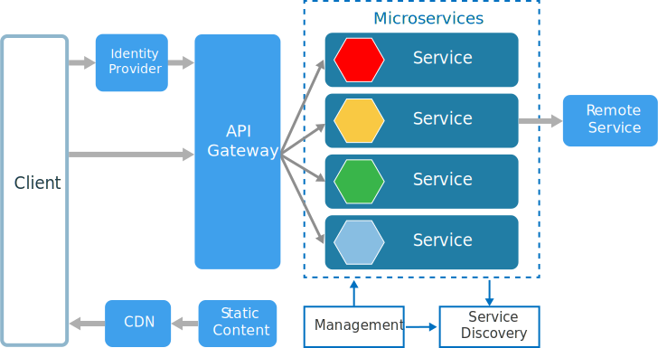

# 2018-09-11(英语，微服务，git提交)

## [English-level-up-tips-for-Chinese](https://github.com/byoungd/English-level-up-tips-for-Chinese)

介绍如何学习英语，其中几个比较好的观点：

1. 学习的根本动机：学习的动机要和目的契合，不然只会导致痛苦的学习，反而不利于进行学习
2. 享受所做的事情
3. 合理的学习计划

## [Microservices architecture style](https://docs.microsoft.com/en-us/azure/architecture/guide/architecture-styles/microservices)



微服务的特征：

* 在一个微服务架构中，服务是小的、独立的以及松散耦合的
* 每一个服务都是一个独立的代码库，可供一个小型的团队进行管理
* 服务可以独立的进行部署
* 服务自己保存数据及状态
* 服务之间通过良好定义好的接口进行通信
* 服务不需要共享相同的技术栈、类库或者框架

使用API网关的有点：

* 将客户端与服务端进行分离
* 服务可以使用对web不友好的消息协议
* API网关可以执行其他交叉功能，如身份验证、日志记录、SSL终止和负载平衡。

使用微服务架构前应该考虑以下架构模式：

* 大型的服务需要高释放速度
* 复制的程序需要高扩展性
* 应用程序需要更多的应用程序
* 由小型的开发团队进行组织

最佳实践：

* 根据业务进行领域划分
* 分散一切
* 服务间通过良好设计的API进行交互
* 避免服务间的耦合
* 将认证和SSL协议之类的迁移到网关
* 将领域相关的信息排除在网关之外
* 服务应该具有松散耦合和高功能内聚力

## Git commit规范

### 格式

提交的格式：

```txt
<type>(<scope>): <subject>
<BLANK LINE>
<body>
<BLANK LINE>
<footer>
```

每一行提交信息都不能超过一百个字符

如果一个提交是一个`revert`操作，其应该开始于`revert`，提交都正文应该是`This reverts commit <hash>.`，其中散列是被还原的提交的散列值

type的取值：

* build: 构建系统的变化或者是外部依赖发生变化
* ci: 更改CI的配置文件或脚本
* docs: 仅仅是文档的更新
* feat: 新的特性
* fix: 修复bug
* perf: 对代码进行优化
* refactor: 对原有的代码进行重构
* style: 对代码的格式进行更改
* test: 增加缺失的测试或者修正现有的测试

scope应该是受到应该的包名，也可以指影响到的业务模块

subject应该包含简洁的变更描述

body应该包含改变的动机，并将其与以前的行为进行对比

footer应该包含变更相关的附属信息，如果是针对某个issue，则可以在footer部分关闭这个issue；比如果此代码与上版本不兼容，应该以`BREAKING CHANGE`开头，后面则是变动的描述以及变动的理由和迁移的方法

### 资料

1. [Contributing to Angular](https://github.com/angular/angular/blob/master/CONTRIBUTING.md)
2. [cz-cli](https://github.com/commitizen/cz-cli)
