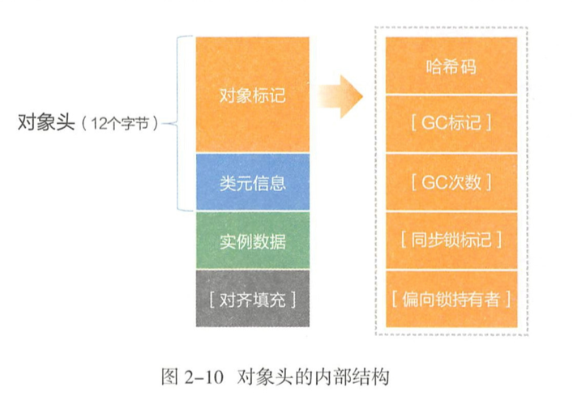
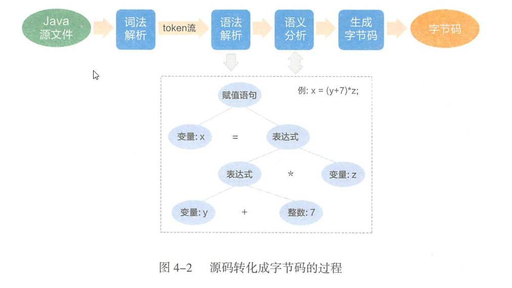
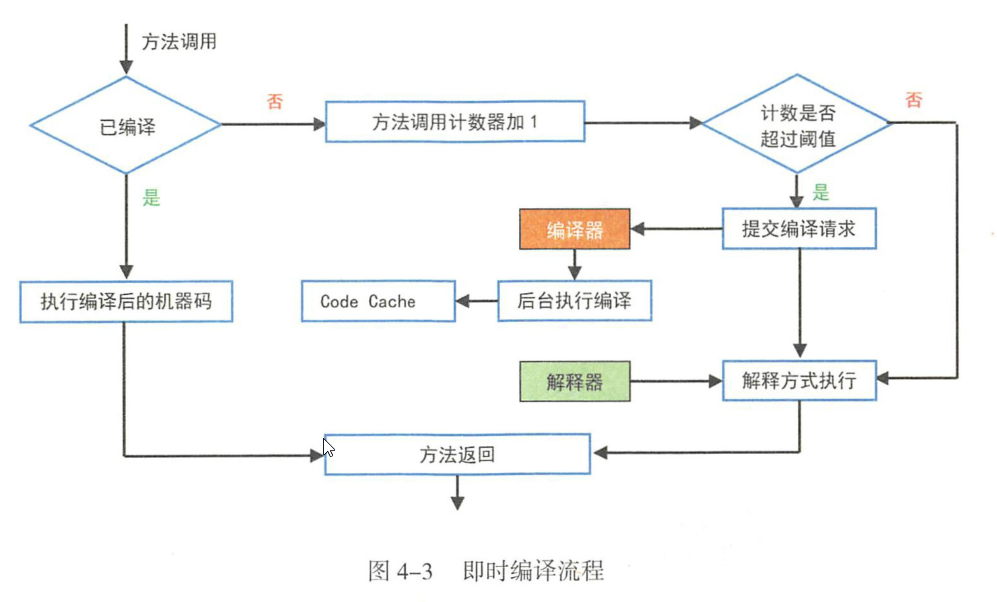
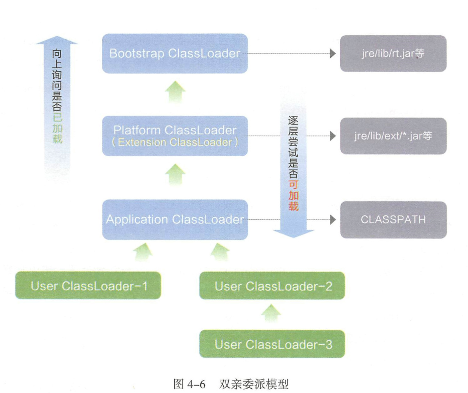
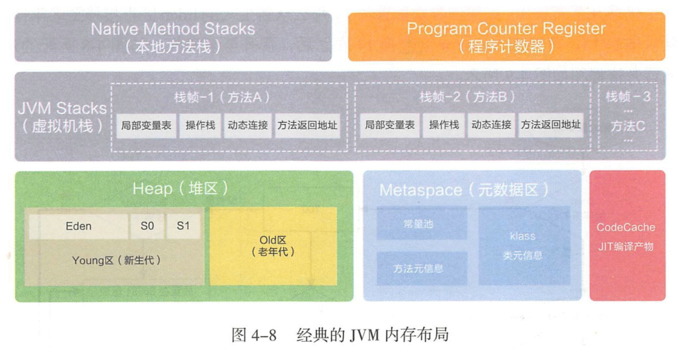
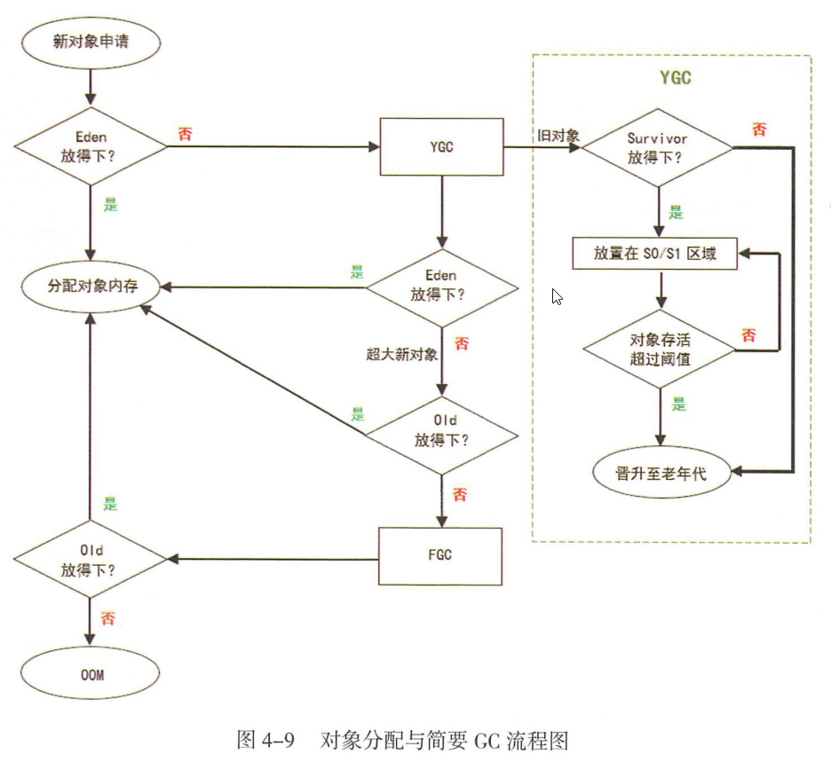
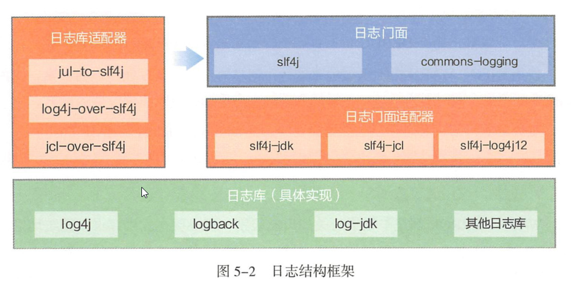

## Chapter 1 计算机基础

`IP`是面向无连接、无状态的，没有额外的机制保证发送的包是否有序到达。

三次握手是指建立连接的三个步骤，目的是信息对等和防止超时:

1. A机器发出一个数据包并将`SYN`置1，表示希望建立连接

2. B机器受到A机器的数据包后，通过`SYN`得知这是一个建立连接的请求，于是发送一个响应包并将`SYN`和`ACK`标记都指1

3. A受到B的响应包后需要进行确认，确认包中将ACK置1

从编程的角度，`TCP`连接是通过文件描述符完成的

`TCP`断开的时候存在`TIME_WAIT`的原因：

1. 确认被动关闭方能够顺利进入`CLOSED`状态

2. 防止请求丢失

如果是参数配置错误导致的系统宕机，即使增加硬件资源，也无法达到好的效果。硬件的增加于性能的提升绝对不是线性相关的，更多的时候是对数曲线关系。

数据库连接池是一种空间换取时间的策略，但是过多同样会影响性能

从经验上来看，在数据库层面的请求应答时间必须在100ms以内，秒级的SQL查询通常存在巨大的性能提升空间，应对方案如下：

1. 建立高效且合适的索引

2. 排查连接资源未显示

3. 合并短请求

4. 合理的拆分多个表`join`的SQL，若是超过三个则禁止`join`

5. 使用临时表

6. 应用层优化

7. 改用其他数据库

需要建立一套完整的信息安全体系，遵循`CIA`原则，既保密性、完整性和可用性

预防`SQL`注入的应该考虑的几个方面

1. 过滤用户输入参数中的特殊字符，从而降低被SQL注入的风险

2. 禁止通过字符串拼接的SQL语句，严格使用参数绑定传入的SQL参数

3. 合理使用数据库访问框架提供的防注入机制

## Chapter 2 面向对象

### 面向对象

`OOP`的三大特性：封装、继承、多态

软件工程的三个主要目标：可维护性、可重用性和可扩展性

面向过程的结构相对松散，强调如何流程化的解决问题；面向对象的思维更加内聚，强调搞内聚、低耦合，先抽象模型，定义共性行为，再解决实际问题，再解决实际问题。

浅拷贝只复制当前对象的所有基本数据类型，以及相应的引用变量，但没有复制引用变量指向的实际对象；而彻底深拷贝实在成功`clone`一个对象之后，此对象与母对象在任何引用路径上都不存在共享实例对象，但是引用路径递归越深，则约接近`JVM`底层对象，且发现彻底拷贝实现难度大。介于浅拷贝和彻底深拷贝之间的都是一般深拷贝。归根到底，慎用`Object`的`clone()`方法来拷贝对象，因为对象的`clone()`方法默认是浅拷贝。

里氏代换原则是指任何父类能够出现的地方，子类都能够出现。

多态是指在编译层面无法确定最终调用方法体，以覆写为基础来实现面向对象特性，在运行期由`JVM`进行动态绑定，调用合适的覆写方法体来执行。重在是编译期确定方法调用，属于静态绑定，本质上重载的结果是完全不同的方法。

### 类设计

抽象类是模板式设计，而接口是契约式设计。

抽象类包含一组相对具体的特征

外部类与内部类之间使用`$`符号分隔，匿名内部类使用数字进行编号，而方法内部类在类名浅还有一个编号来标识是哪个方法。

定义报能可见静态内部类的好处是：

1. 作用域不会扩散到包外

2. 可以通过“外部类.内部类”的方式直接访问

3. 内部类可以访问外部类中的所有静态属性和方法

访问级别控制：

1. 如果不允许外部直接通过`new`创建对象，构造方法必须是`private`的

2. 工具类那个不允许有`public`或`default`构造方法

3. 类非`static`成员变量并且与子类共享，必须是`protected`

4. 类非`static`成员变量并且仅在本类使用，必须是`private`

5. 类`static`成员变量如果仅在本类使用，必须是`private`

6. 若是`static`成员变量，必须考虑是否为`final`

7. 类成员方法只提供类内部调用，必须是`private`

8. 类成员方法只对继承公开，那么限制为`protected`

任何类在创建之处，都有一个默认的空构造方法，它是`super()`的一条默认通路。

一个实例变量可以通过`this.`赋值另一个实例变量；一个实例方法可以通过`this.`调用另一个实例方法；甚至一个构造方法都可以通过`this.`调用另一个构造方法。

类关系情况：

* 继承(is-a)

* 实现(can-do)

* 组合(contains-a)

* 聚合(has-a)

* 依赖(use-a)

将数据对象转换为二进制流的过程称为对象的序列化，将二进制流恢复为数据对象的过程称为反序列化。

有些对象的敏感属性不需要进行序列化传输，可以加`transient`关键字，避免把此属性信息转换为序列化的二进制流

### 方法

参数预处理包括两种：

1. 入参保护

2. 参数校验

静态方法需要注意的地方：

1. 静态方法中不能使用实例成员变量和实例方法

2. 静态方法不能使用`super`和`this`关键字，这两个关键子指代的都是需要被创建出来的对象

在实际应用中如初始化容器时，可以使用静态代码块加载判断、属性初始化、环境配置等。

`POJO`专门指只包含`getter`、`setter`、`toString`方法的简单类。

`getter`和`setter`中错误使用的定义方式：

1. `getter/setter`中添加业务了逻辑

2. 同时定义`isXxx()`和`getXxx()`

3. 相同的属性名容易带来歧义

如果某个类覆写了父类的某个方法，则方法表中的方法指向会指向子类的实现处。

向上转型时，通过父类引用执行子类方法需要注意：

1. 无法调用到子类中存在而父类本身不存在的方法

2. 可以调用到子类中覆写了父类的方法，这是一种多态实现

成功覆写父类方法，需要满足的四个条件，并且只能针对非静态、非`final`、非构造方法：

1. 访问权限不能变小

2. 返回类型能够向上转型成为父类的返回类型

3. 异常也要能向上转型成为父类异常

4. 方法名，参数类型及个数必须严格一致

### 重载

`JVM`重载方法顺序的选择方式：

1. 精准匹配

2. 如果是基本数据类型，自动转换程更大表示范围的基本类型

3. 通过自动拆箱和装箱

4. 通过子类向上转型继承路线依次匹配

5. 通过可变参数匹配

### 数据类型

`refvar`是基本数据类型，它的默认值是`null`，存储`refobj`的首地址，可以直接使用双等号`==`进行等值判断。

一个`refvar`至多存储一个`refobj`的首地址，一个`refobj`可以被多个`refvar`存储下它的首地址，即一个堆内对象可以被多个`refvar`引用指向

对于在-128到127直接的`Integer`对象由`IntegerCache.cache`产生，会复用已有的对象，这个区间可以直接使用`==`进行判断，但是这个区间外的所有数据都会在堆上产生，并不会复用已有对象，所以包装类型都使用`equals()`进行比较

包装类型和基础数据类型的选择：

1. 所有的`POJO`类属性必须使用包装数据类型

2. `RPC`方法的返回值和参数必须使用包装数据类型

3. 所有的局部变量推荐使用基本数据类型

`StringBuilder`是非线程安全的，线程安全的对象先产生是因为计算机的发展总是从单线程到多线程，从单机到分布式

## Chapter 3 代码风格

命名上可体现出代码元素的特征，仅从名字上可知道代码元素的属性是什么，有利用快速厘清代码脉络。

命名需要遵守的约定:

1. 命名符合本语言特性

2. 命名体现现代代码元素特征

3. 命名最好望文知意

空格使用的约定：

1. 任何二目、三目运算符的左右两边都必须加一个空格

2. 注释的双斜线与注释内容之间有0仅有一个空格。

3. 方法参数在定义和传入时，多个参数逗号后边心须加空格。

4. 没有必要增加若十空格使变量的赋值等号与上一行对应位的等号对齐。

5. 如来是大括号内为空，则简洁地写成`{}`即可，大括号中间无须焕行和空格

6. 左右小括号与括号内部的相邻字符之间不要出现空格

7. 左在大括号前需要加空格。

约定单个方法的总行数不超过80行。

多层嵌套不能超过三层，避免采用反逻辑运算符

## Chapter 4 走进 JVM

### 字节码

字节码主要指令如下：

1. 加载或存储指令
   
   1. 讲局部变量加载到操作栈种
   
   2. 从操作栈顶存储到局部变量表
   
   3. 讲常量加载到操作栈顶

2. 运算指令

3. 类型转换指令

4. 对象创建与访问指令
   
   1. 创建对象指令
   
   2. 访问属性指令
   
   3. 检查实例类型指令

5. 操作栈管理指令
   
   1. 出栈操作
   
   2. 复制栈顶元素并压入栈

6. 方法调用与返回指令
   
   1. `INVOKEVIRTUAL`指令
   
   2. `INVOKESPACIAL`指令
   
   3. `INVOKESTATIC`指令
   
   4. `RETURN`指令

7. 同步指令

执行有三种模式：

1. 解释执行

2. `JIT`编译执行

3. `JIT`编译与混合执行

机器在热机状态可以承受的负载要大于冷机状态，如果以热机状态是的浏览进行切换，可能使处于冷机状态的服务器因无法承载流量而假死

### 类加载过程

主要流程：

1. `LOAD`阶段读取类文件产生的二进制流，并转换为特定的数据结构

2. `Link`阶段包括验证、准备、解析三个步骤

3. `Init`阶段执行类构造器`<clinit>`方法，如果赋值运算是通过其他类的静态方法来完成的，如果马上解析另外一个类，在虚拟机栈种执行完毕后柘荣刚返回值进行赋值

类加载过程是一个讲`.class`字节码文件实例化程`Class`对象并进行相关初始化的过程

`new`是强类型校验，可以调用任何构造方法，在使用`new`操作的时候，这个类可以没有被加载过。而`Class`类下的`newInstance`是弱类型，只能调用无参构造方法，如果没有默认的构造方法，就抛出`InstantiationExeception`异常，如果此构造器没有访问权限，就抛出`IllegalAccessExeception`

通过`setAccessible(true)`操作，可以是用大写`Class`类的`set`方法修改其值

`AppClassLoader`的`Parent`为`Bootstrap`

低层次的当前类加载器，不能覆盖更高层次类加载的类

自定义类加载器的情况：

1. 隔离加载类

2. 修改类加载方式

3. 扩展加载源

4. 防止源码泄露

实现自定义类加载器的步骤：继承`ClassLoader`，重写`findClass()`方法，调用
`defineClass()`方法。

### 内存布局

栈帧包括局部变量表、操作栈、动态连接、方法返回地址等

从字节码角度看待对象的创建过程：

1. `NEW`：如果找不到`Class`对象，则进行类加载

2. `DUP`：在栈顶赋值该引用变量，这时的栈顶有两个指向堆内实例对象的引用变量

3. `INVOKESPECIAL`：调用对象实例方法，通过栈顶的引用变量调用`<init>`方法

从执行步骤的角度：

1. 确认类源信息是否存在

2. 分配对象内存

3. 设定默认值

4. 设定对象头

5. 执行`init`方法

### 垃圾回收

如果一个对象与`GCRoots`之间没有直接或间接的引用关系，比如某个失
去任何引用的对象，或者两个互相环岛状循环引用的对象等，判决这些对象“死缓是可以被回收的。

## Chapter 5 异常与日志

异常捕获是针对飞稳定代码的，捕获时要区分异常类型并做相应处理。

无论采用哪种方式处理异常，都严禁捕获异常后什么都不做或打印一行日志了事。如果在方法内部处理异常，需要根据不同的业务场景进行定制处理，如重试、回滚等操作。如果向上抛出异常，如上例所示，需要在异常对象中添加上下文参数、局部变量、运行环境等信息，这样有利于排查问题。

如果`finally`代码块没有执行，可能有三种情况：

* 没有进入`try`代码块

* 进入`try`代码块，但是代码运行种出现了死循环或死锁状态

* 进入`try`代码块，但是执行了`System.exit()`

`finally`代码块的职责不在于堆变量进行赋值等操作，而是清理资源、释放连接、关闭管道流等操作，此时如果发送异常也要进行捕获

在`try`代码块之前调用`lock()`方法，避免由于加锁失败导致`finanlly`调用`unlock()`抛出异常

推荐对外提供的凯放接口使用错误码了；公司内部跨应用远程服务调用优先考虑使用`Result`对象来封装错误码、错误描述对象；而应用内部则推荐直接抛出异常对象

记录系统日志主要有三个原因：记录操作轨迹、监控系统运行状况、回溯系统故障

包装记录的完整：

1. 记录异常时一定要输出异常堆栈

2. 日志种如果输出对象实例，要确保类实例重写了`toString`方法，否则只会输出对象的`hashCode`，没有实际意义

