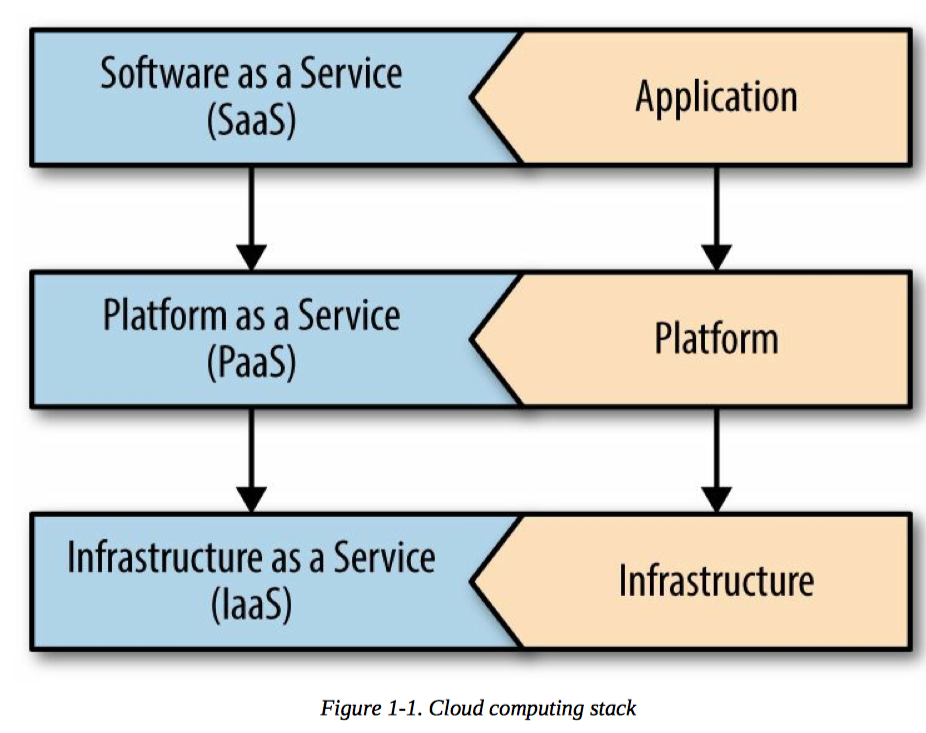

## 第一章



源码仓库要能存下一整个程序的信息和他的相关依赖，并且不需要在各个环境中重新编译
或打包代码


1. 一个代码库在一个版本控制库中，能在多个环境中部署
2. 明确的声明和隔离依赖
3. 将配置文件放入到环境中：应用成员应该严格的根据配置划分
4. 将支持的服务视为附加资源
5. 严格的分卡构建阶段和运行阶段
6. 将应用程序视为一个或多个无状态进程
7. 通过特定的端口暴露服务
8. 通过流程模型横线扩展
9. 通过快速启动和正常的
10. 尽可能的保证开发，预发和生成的一致
11. 将日志视为一个事件流
12. 将管理 / 管理任务作为一次性流程运行

## 第二章

`Spring`框架的`Assert`类支持契约式设计而不仅仅用于单元测试。

可以在一个类中创建所有的对象，并建立他们之间的联系，这个原理被称为反转控制（IOC)。

可以创建只依赖基础类型和接口的组建代码，而不依赖于特定的实现，这被称为依赖注入（DI）。

切点描述了应用内部的匹配方式

在含有`@Configuration`的应用程序配置类中加入`@EnableAspectJAutoProxy`，然后我们只需要将横切面转换成一个类，并在其上加入`@Aspect`注解

将`@EnableTransactionManagement`添加到配置类中，然后使用`@Transactional`注解划定业务服务的事务边界。

在`Spring boot`中，提供默认和高可用的配置是最高优先级，约定优于配置

Spring boot 实现了开闭原则：对扩展开放，但是对修改关闭

当需要对 Spring boot 进行调试时候，可以再 Spring boot 应用启动时候加入`--Debug=true`，这会打印出当前的所有配置项

## 第三章

### Spring 框架对配置的支持

[十二要素程序宣言](https://12factor.net/)

`Enviornment`接口提供了运行中应用程序及其运行时环境之间的隔离，并允许应用程序提出关于环境的问题。

`@PropertySource`将可以是 Spring 从文件中加载配置文件，特别是以类似于以前版本的 Spring 属性占位符解析的方式

`Profile`可以用来描述从一个环境变化到另一个环境的 bean 和 bean 图

`@Value`注解提供了一种将环境变量注入到构造器，setter 及属性中的方法

命令行参数会覆盖由`JNDI`提供的属性值，而`JNDI`的属性值又会覆盖由`System.getProperties()`提供的属性值

Spring boot 也会自动的加载`.yml`配置文件

Spring 允许映射所有的配置到 POJO 类似的配置当中

`@EnableConfigurationProperties`注解将让 Spring 映射配置到有`@ConfigurationProperties`注解的 POJO 上

### Spring Cloud

在 Spring Cloud 系统中运行时，Spring boot 应用程序需要一个唯一的名字，这个名字最好容易记住

在有配置的注解的类上加入`@RefreshScope`注解，可以让 Spring boot 应用程序自动更新配置，自己重新构建`Bean`，在这种情况下，只要触发了`refresh`事件，就会重建其所注解的类，初始化其生命周期，并重新建立`@Value`和`@Autowried`注入。

`Spring`会重新创建所有标记了`@RefreshScope`注解的`bean`，而且是直接丢弃整个`bean`并创建一个新的`bean`

所有刷新范围的 Bean 都将在收到 Spring 应用程序上下文的`RefreshScopeRefreshedEvent`类型的时间后进行更新

`Spring Cloud Bus`支持刷新多个应用程序上下文实例

`Spring Cloud Stream`支持不同的消息技术

对于其他用于常规性、非总线相关处理的实例，可以使用`Sring`限定符注解`@Primary`来进行注解

## 第四章

集成测试的实践侧重于针对一组相互依赖的软件模块编写和执行测试用例。云原生应用应该专注于如何设计集成测试，使它能够在与其他应用软件无关的临时环境中执行

无论采用何种方式，一定确保得向生产环境部署二进制包之前，能够自动的运行所有测试用例。

十二要素程序中的一个重要原则是，应该尽量减少开发环境和生产环境之间的差异

`Mock`对象允许我们隔离测试系统的一部分，通过一种受控的方式，用具有类似测试行为对象来代替实际的对象

端到端测试侧重于从用户角度测试功能

`Spring`中集成测试是指在测试执行期间需要访问`Spring`应用程序的上下文，而单元测试 不需要访问`Spring`应用程序上下文

`@RunWith`注解告诉`JUnit`使用那个测试运行器策略

`@SpringBootTest`注解将指明此类是一个 Spring Boot 的测试类，并且提供了扫描`ContextConfiguration`的支持，并且告诉如何加载 ContextConfiguration。当没有自定义的配置类被扫描到的时候，将会加载在 Spring 框架包中的配置文件。

在集成测试执行的过程中任何测试都需要访问 Spring context，而单元测试的不需要Spring context。

在 Spring boot 程序中，我们需要部署`.jar`文件，所以`@SpringBooTest`支持`webEnvironment`
属性去描述 Spring boot 在程序运行的时候应该怎么配置嵌入式的容器

`@JsonTest`注解运行仅仅是测试 JSON 的序列化和反序列化。

`@DataJpaTest`提供了在使用 Sring data JPA 的项目中进行测试方法。`TestEntityManager`
提供了无需数据库就能与底层数据存储进行交互的方式。

`@RestClientTest`注解可以将一个 service 注解一个实例以及将一个 RestTemplate
注册为自动测试配置的一部分

契约测试始终隐藏生产者 API 的实现

## 第五章

Spring session 是 Servert HTTP Session API 的用 SPI 处理同步的插入式替换。

Servlet API 要求对象必须重新实现 Java 的序列化以此来重写 HTTP Session。

## 第六章

[REST 成熟度模型](https://martinfowler.com/articles/richardsonMaturityModel.html)：

0. The swamp of Pox
1. Resource
2. HTTP verbs
3. Hypermedia controls

基本上，使用例如 Spring MVC 或者 Flask 之类的框架的时候，已经处于第二个级别了，即便是错误的使用了这几个框架，那么最终的`API`仍然可能是符合二级的。

内容协商是 HTTP 最强大的功能之一：同一个服务可以同时支持多个使用不同协议的客户端

文件上传可能会阻塞和独占`Servlet`容器的线程池。`Spring MVC`后台的`Callable<T>`处理器方法会将返回值返回给配置好的`Executor`线程池，并释放容器线程，直到响应准备就绪。

servlet 容器维护着一个 HTTP 请求的线程池

`CustomerRestController`中处理器方法可以对现有的记录进行操作，如果没有找到改记录，则抛出异常。 

`Spring MVC`支持在处理器方法上使用`@ExceptionHandler`注解，来监听和响应`Spring MVC`控制器中的错误条件。

错误是一个有效`API`的重要组成部分，错误应该唯一、简洁地向自动化客户端指出错误情况，并为最终解决问题的人提供支持，至少要让他们了解错误的含义。

超媒体指的是，日常资源的链接通过向客户端提供信息，最终导致应用状态的变化。

在`Spring HATEOAS`中，`Resource`是一个包含数据和一组相关链接的封装对象。

`API`版本的一种方法是使用语义版本控制，语义版本是`MAJOR`，`MINOR.PATHC`是其中的一种形式，`MAJOR`版本好只有在`API`不兼容以前的版本时才会更改，`MINOR`版本号应该在`API`发生改版单现有客户端还能够继续使用的情况下更改，`PATCH`版本好的更改表示对现有功能的修复。

`Spring Data REST`会根据指定的`Spring Data repository`自动创建一个具有`HAL`风格的超媒体链接

## 第七章

`CAP`原理指出，分布式系统不可能同时提供以下三个属性：一致性、可用性和分区容忍性。

## 第八章

`Zuul`过滤器默认有四种类型：

- `pre`过滤器在请求路由之前执行

- `routing`过滤器可以处理请求的实际路由

- `post`过滤器在请求路由之后执行

- 如果在处理请求的过程中发生错误，则会执行`error`过滤器

限速器的两种算法：

1. 令牌桶算法

2. 漏桶算法

在`Web`层中，`Spring Security`会以一个单独的`javax.servlet.Filter`存在(从`Web`容器角度来看)，然后委托给`Filter`实例的其他虚拟链

`UserDetailsService`实现的约定：给定一个字符串`username`，返回一个`UserDetails`实现，或者抛出一个`UsernameNotFoundException`异常，在任何情况下，它都不应该返回`null`

如果我们添加一个`@EnableResourceServer`注解，将授权服务器配置为一个资源服务器，那么对于那些处理带访问令牌的`Spring MVC`处理器来说，`Spring Security OAuth`会自动为它们提供一个`java.security.Principal`对象，并且还会将其转换为资源服务器可以使用的`JSON`格式

## 第九章

良好的数据模型可以有效地传达软件中的业务需求

领域驱动设计目的在解决问题是软件设计中的复杂性

大多数数据仓储仅专注于提供最佳数据存储，而对可用性关注不足

域类(domain class)是一个基本的类，其作为域数据模型，由一组专用字段组成，并根据域模型的设计，使用`public getter`和`setter`公开其内容

通过使用`Repository`模式，数据消费着只需要关心违反约束条件的一类异常


有界的上下文是将业务领域的一部分模块化为单独的统一模型的一种方式，每个有界的上下文可以有一组无关的概念，同时明确共享概念之间的联系

通过在实体类上加上`@EntityListensers(AuditingEntityListener.class)`以及在配置类上加入`@EnableJpaAuduiting`来开启审计

使用`MongoDB`进行审计的时候需要配置`AbstractMongoEventListenser`，并且需要一个基本的实体类，其他实体通过继承用于审计，下面是一个实例代码：

```java
/**
 * 实体类.
 */
@Data
public class BaseEntity {
    private LocalDateTime lastModified;
    private LocalDateTime createdAt;
}

/**
 * 配置类.
 */
@Componet
class MongoListenserConfig extends AbstarctMongoEventListenser<BaseEntity> {

    @Override
    public void onBeforeSave(BeforeSaveEvent(BaseEntity) entity) {
        if (Objects.isNull(event.getSource().getCreatedAt())) {
            event.getSource().setCreateAt(LocalDateTime.now());
        }
        
        event.getSource().setLastModified(LocalDateTim.now());
        super.onBeforeSave(event);
    }
   
}
```

图数据库将数据库对象表示为节点和关系的连接图


