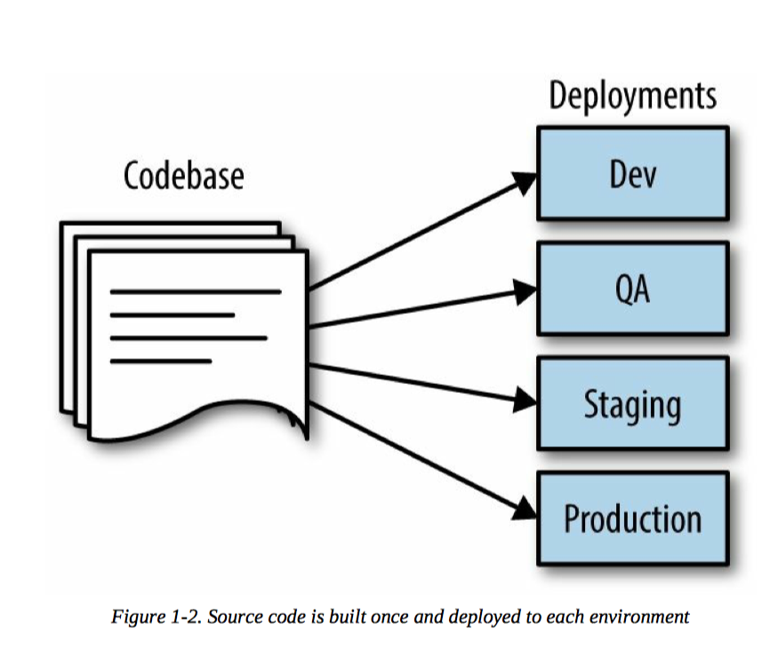

# Cloud Native Java

## 第一章

源码仓库要能存下一整个程序的信息和他的相关依赖，并且不需要在各个环境中重新编译
或打包代码

1. 一个代码库在一个版本控制库中，能在多个环境中部署
2. 明确的声明和隔离依赖
3. 将配置文件放入到环境中：应用成员应该严格的根据配置划分
4. 将支持的服务视为附加资源
5. 严格的分卡构建阶段和运行阶段
6. 将应用程序视为一个或多个无状态进程
7. 通过特定的端口暴露服务
8. 通过流程模型横线扩展
9. 通过快速启动和正常的
10. 尽可能的保证开发，预发和生成的一致
11. 将日志视为一个事件流
12. 将管理 / 管理任务作为一次性流程运行

## 第二章

### AOP

切点描述了应用内部的匹配方式

在含有`@Configuration`的应用程序配置类中加入`@EnableAspectJAutoProxy`，然后我们
只需要将横切面转换成一个类，并在方法上面加入注解就行

将`@EnableTransactionManagement`添加到配置类中，然后使用`@Transaction`注释划定
业务服务的事务边界。

在 Spring boot 中，提供默认和高可用的配置是最高优先级

Spring boot 实现了开闭原则：对扩展开放，但是对修改关闭

当需要对 Spring boot 进行调试时候，可以再 Spring boot 应用启动时候加入`--Debug=true`

## 第三章

`@PropertySource`将可以是 Spring 从文件中加载配置文件，特别是以类似于以前版本的
Spring 属性占位符解析的方式

`@Value`注解提供了一种将环境变量注入到构造器，setter 及属性中的方法

Spring boot 也会自动的加载`.yml`配置文件

Spring 允许映射所有的配置到 POJO 类似的配置当中

`@EnableConfigurationProperties`注解将让 Spring 映射配置到有`@ConfigurationProperties`
注解的 POJO 上

在 Spring Cloud 系统中运行时，Spring boot 应用程序需要一个唯一的名字，这个名字
最好容易记住

在有配置的注解的类上加入`@RefreshScope`注解，可以让 Spring boot 应用程序自动更新配置

所有刷新范围的 Bean 都将在收到 Spring 应用程序上下文的`RefreshScopeRefreshedEvent`
类型的时间后进行更新

Spring Cloud Bus 支持刷新多个应用程序上下文实例

Spring Cloud Stream 支持不同的消息技术

## 第四章

`@SpringBootTest`注解将指明此类是一个 Spring Boot 的测试类，并且提供了扫描
`ContextConfiguration`的支持，并且告诉如何加载 ContextConfiguration。当没有自定
义的配置类被扫描到的时候，将会加载在 Spring 框架包中的配置文件。

在集成测试执行的过程中任何测试都需要访问 Spring context，而单元测试的不需要 
Spring context。

在 Spring boot 程序中，我们需要部署`.jar`文件，所以`@SpringBooTest`支持`webEnvironment`
属性去描述 Spring boot 在程序运行的时候应该怎么配置嵌入式的容器

`@JsonTest`注解运行仅仅是测试 JSON 的序列化和反序列化。

`@DataJpaTest`提供了在使用 Sring data JPA 的项目中进行测试方法。`TestEntityManager`
提供了无需数据库就能与底层数据存储进行交互的方式。

`@RestClientTest`注解可以将一个 service 注解一个实例以及将一个 RestTemplate 
注册为自动测试配置的一部分

契约测试始终隐藏生产者 API 的实现

## 第五章

Spring session 是 Servert HTTP Session API 的用 SPI 处理同步的插入式替换。

Servlet API 要求对象必须重新实现 Java 的序列化以此来重写 HTTP Session。

## 第六章

[REST 成熟度模型](https://martinfowler.com/articles/richardsonMaturityModel.html)：

0. The swamp of Pox
1. Resource
2. HTTP verbs
3. Hypermedia controls

基本上，使用例如 Spring MVC 或者 Flask 之类的框架的时候，已经处于第二个级别了

servlet 容器维护着一个 HTTP 请求的线程池

`@ExceptionHandler`处理程序与可能抛出异常的处理程序位于同一个控制器组件中。

错误应该唯一且简明地指示客户端的错误状况并支持自然语言，并且最终解决或着解释错误的发生。

Spring HATEOAS 提供了 VndError 和 VndErrors 来对个别的错误或者错误集进行封装

