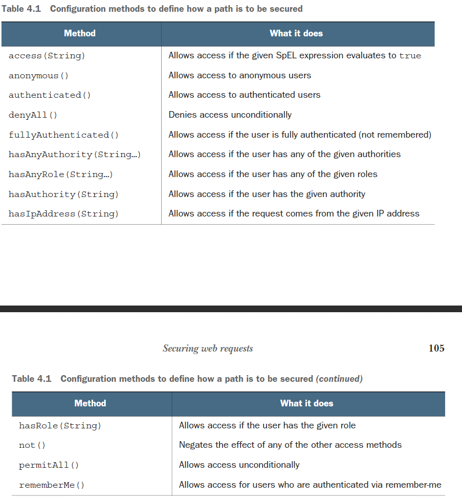
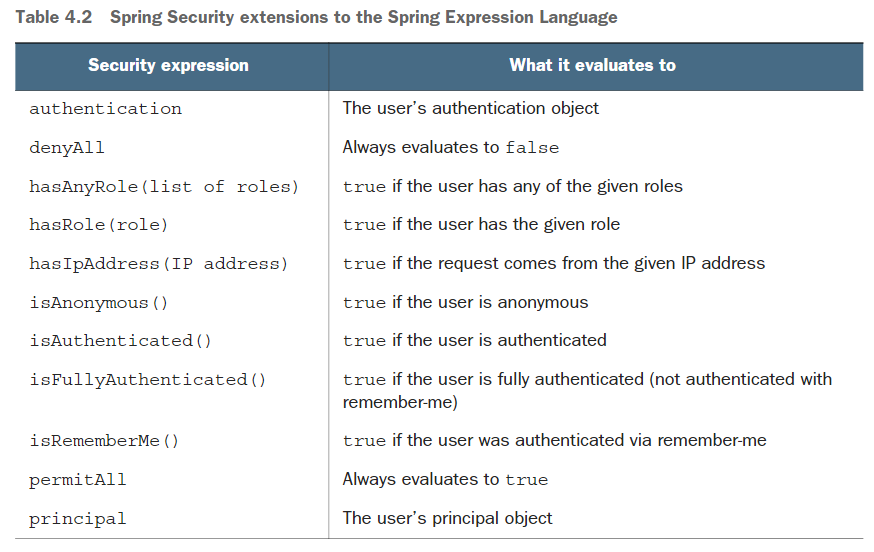
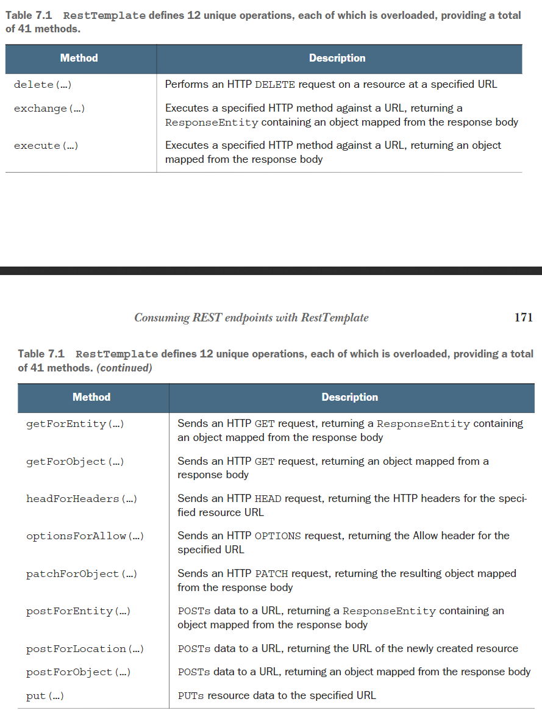
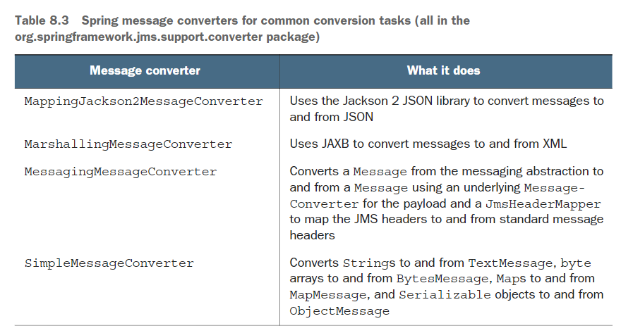
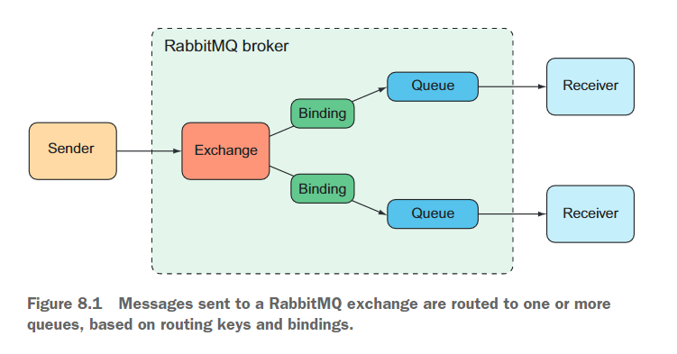
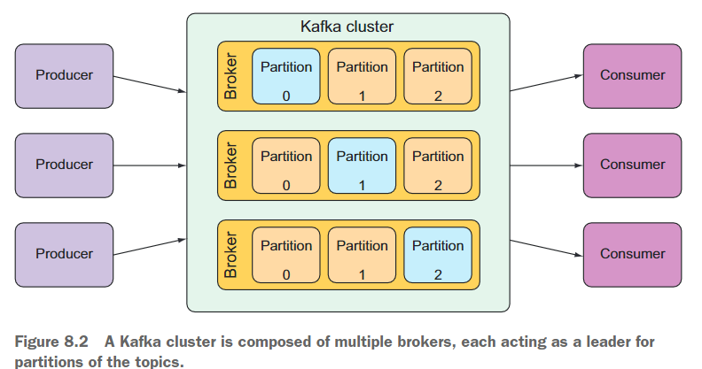

## Foundation

SpringFramework was introduced in Rod Johnson’s book, Expert One-on-One J2EE Designand Development

The `@Configuration` annotation indicates to Spring that this is a configuration classthat will provide beans to the Spring application context.

`@Bean` indicating that the objects they return should be addedas beans in the application context (where, by default, their respective bean IDs willbe the same as the names of the methods that define them)

`spring-boot-starter-parent` as its parentPOM. Among other things, this parent POM provides dependency management forseveral libraries commonly used in Spring projects.

`@WebMvcTest` is a special test annotation provided by Spring Boot that arranges for the test to run inthe context of a Spring MVC application

Spring boot DevTools:

-   Automatic application restart when code changes
-   Automatic browser refresh when browser-destined resource change
-   Automatic disable of template caches
-   Built in H2 Console if the H2 database is in use

### Spring MVC

To apply validation in Spring MVC, you need to:

-   Declare validation rules on the class that is to be validated
-   Specify that validation should be performed in the controller methods thatrequire validation
-   Modify the form views to display validation errors

To validate a domain, you need to add the Java Bean Validation API's `@Valid` annatation

Thymeleaf offers convenient access to the Errors object via the fields property andwith its th:errors attribute.

By default, templates are only parsed once, when they’re first used, and the resultsof that parse are cached for subsequent use.

### Spring Data

wo ways to save data with JdbcTemplate include the following:

-   irectly, using the `update()` method
-   sing the `SimpleJdbcInsert` wrapper classListing

The `update()` method,used when saving ingredient data, doesn’t help you get at the generated ID

The `update()` method you need accepts a `PreparedStatementCreator` and a `Key-Holder`. It’s the `KeyHolder` that will provide the generated taco ID. But in order to useit, you must also create a `PreparedStatementCreator`

JPA requires that entities have a no-arguments constructor

### Spring Security

By doing nothing more than adding the security starter to the project build, youget the following security features:

-   All HTTP request paths require authentication
-   No specific roles or authorities are required
-   There’s no login page
-   Authentication is prompted with HTTP basic authentication
-   There’s only one user; the username is user

Spring Security offers several options for configuring a user store,including these:

-   An in-memory user store
-   A JDBC-based user store
-   An LDAP-backed user store
-   A custom user details service

`UserDetailsService`'s `loadByUsername()` method has one simple rule: it must never return null.

有关用户配置信息的配置类位于`WebSercurityConfigurerAdater`中

Among the many things you can con-figure with HttpSecurity are these：

-   Requiring that certain security conditions be met before allowing a request tobe served
-   Configuring a custom login page
-   Enabling users to log out of the application
-   Configuring cross-site request forgery protection

The `and()` method signifies that you’refinished with the authorization configuration and are ready to apply some addi-tional HTTP configuration.

By default, Spring Security listens for login requests at `/login` and expects that the username and password fields be named `username` and `password`.

Spring Security listen for requests to `/authenticate` to handle login submissions.

There are several ways to determine who the user is. These are a few of the mostcommon ways:

-   Inject a `Principal` object into the controller method
-   Inject an `Authentication` object into the controller method
-   Use `SecurityContextHolder` to get at the security context
-   Use an `@AuthenticationPrincipal` annotated method

### Configuration properties

It’s important to establishthat there are two different (but related) kinds of configurations in Spring:

-   Bean wiring
-   Property injection

The Spring environment abstraction is a one-stop shop for any configurable property.

The Spring environment pulls from several propertysources, including:

-   JVM system properties
-   Operation system environment variables
-   Command-line arguments
-   Application property configuration files

To support property injection of configuration properties, Spring Boot providesthe @ConfigurationProperties annotation. When placed on any Spring bean, itspecifies that the properties of that bean can be injected from properties in theSpring environment.

the `@Profile` annotation can designate beans as onlybeing applicable to a given profile

## Integrated Spring

### RESTFull

`@CrossOrigin` allows clients from any domain to consume the API

`@RequestBody` annotation ensures that JSON in therequest body

It’s always a good idea to use `@ResponseStatus` where appropriate to communicate the most descriptive and accurate HTTP status code to the client

### HATOAS

The `Resource` type represents a single resource, whereas `Resources` is a collection of resources.

`ResourceSupport` to inherit a list of Link object and methods to manage the list of links

The `@Relation` annotation can help break the coupling between the JSON fieldname and the resource type class names as defined in Java.

The `@RestResource` annotation lets you give the entity any relation name and pathyou want.

### Spring Data REST

their endpoints seem somewhatdetached from the Spring Data REST endpoints in a couple of ways:

-   Your own controller endpoints aren’t mapped under Spring Data REST’s basepath.
-   Any endpoints you define in your own controllers won’t be automaticallyincluded as hyperlinks in the resources returned by Spring Data REST end-points.

### Spring RestTemplate

A Spring application can consume a REST API with:

-   `RestTemplate` — A straightforward, synchronous REST client provided by thecore Spring Framework.
-   `Traverson` — A hyperlink-aware, synchronous REST client provided by Spring HATEOAS. Inspired from a JavaScript library of the same name.
-   `WebClient` — A reactive, asynchronous REST client introduced in Spring 5.

The `ResponseEntity` gives access toadditional response details, such as the response headers.

## Async Message

### JMS

Spring supports JMS through a template-based abstraction known as `JmsTemplate`.

Each of these three method categories is composed of three overriding methods that are distinguished by how the JMS destination (queue or topic) isspecified:

-   One method accepts no destination parameter and sends the message to adefault destination.
-   One method accepts a `Destination` object that specifies the destination forthe message.
-   One method accepts a `String` that specifies the destination for the messageby name.

Specifying the destination with a `Destination` object like this affords you the opportunity to configure the `Destination` with more than just the destination name.

### RabbitMQ and AMQP

AMQP messages are addressed with the name of an exchange and a routing key, which are decoupled from the queue that the receiver is listening to.

There are several different kinds of exchanges, including the following:

-   Default — A special exchange that’s automatically created by the broker. It routes messages to queues whose name is the same as the message’s routing key. All queues will automatically be bound to the default exchange.
-   Direct — Routes messages to a queue whose binding key is the same as the mes-sage’s routing key.
-   Topic — Routes a message to one or more queues where the binding key (whichmay contain wildcards) matches the message’s routing key.
-   Fanout — Routes messages to all bound queues without regard for binding keysor routing keys.
-   Headers — Similar to a topic exchange, except that routing is based on message header values rather than routing keys.
-   Dead letter — A catch-all for any messages that are undeliverable (meaning they don’t match any defined exchange-to-queue binding)

Spring offers several message converters for RabbitTemplate, includingthe following:

-   Jackson2JsonMessageConverter — Converts objects to and from JSON usingthe Jackson 2 JSON processor
-   MarshallingMessageConverter — Converts using a Spring Marshaller and Unmarshaller
-   SerializerMessageConverter — Converts String and native objects of anykind using Spring’s Serializer and Deserializer abstractions
-   SimpleMessageConverter — Converts String, byte arrays, and Serializable types
-   ContentTypeDelegatingMessageConverter — Delegates to another Message-Converter based on the contentType header
-   MessagingMessageConverter — Delegates to an underlying MessageConverterfor the message conversion and to an `AmqpHeaderConverter` for the headers

For `message-driven` RabbitMQ beans, Spring offers `RabbitListener`, the RabbitMQ counterpart to `JmsListener`.

### Kafka

The `topic` and `payload` are the two most important parameters.

### Spring Integration

`@MessagingGateway` is tells Spring Integration to generate an implementation of this interfaceat runtime—similar to how Spring Data automatically generates implementations ofrepository interfaces.

Three configuration options for declaring integration flows include these:

-   XML configuration
-   Java configuration
-   Java configuration with a DSL

The role each of these com-ponents plays in an integration flow:

-   `Channels`—Pass messages from one element to another.
-   `Filters`—Conditionally allow messages to pass through the flow based on somecriteria.
-   `Transformers`—Change message values and/or convert message payloads fromone type to another.
-   `Routers`—Direct messages to one of several channels, typically based on mes-sage headers.
-   `Splitters`—Split incoming messages into two or more messages, each sent to dif-ferent channels.
-   `Aggregators`—The opposite of splitters, combining multiple messages coming infrom separate channels into a single message.
-   `Service activators`—Hand a message off to some Java method for processing, andthen publish the return value on an output channel.
-   `Channel adapters`—Connect a channel to some external system or transport. Caneither accept input or write to the external system.
-   `Gateways`—Pass data into an integration flow via an interface.

Spring Integration provides several channel implementations, including these:

-   PublishSubscribeChannel—Messages published into a PublishSubscribe-Channel are passed on to one or more consumers.
-   QueueChannel—Messages published into a QueueChannel are stored in a queueuntil pulled by a consumer in a first in, first out (FIFO) fashion. If there aremultiple consumers, only one of them receives the message.
-   PriorityChannel—Like QueueChannel but, rather than FIFO behavior, mes-sages are pulled by consumers based on the message priority header.
-   RendezvousChannel—Like QueueChannel except that the sender blocks thechannel until a consumer receives the message, effectively synchronizing thesender with the consumer.
-   DirectChannel—Like PublishSubscribeChannel but sends a message to a sin-gle consumer by invoking the consumer in the same thread as the sender. Thisallows for transactions to span across the channel.
-   ExecutorChannel—Similar to DirectChannel but the message dispatch occursvia a TaskExecutor, taking place in a separate thread from the sender. Thischannel type doesn’t support transactions that span the channel.
-   FluxMessageChannel—A Reactive Streams Publisher message channel based onProject Reactor’s Flux. (We’ll talk more about Reactive Streams, Reactor, andFlux in chapter 10.)

Filters can be placed in the midst of an integration pipeline to allow or disallow mes-sages from proceeding to the next step in the flow

Transformers perform some operation on messages, typically resulting in a differentmessage and, possibly, with a different payload type

Routers, based on some routing criteria, allow for branching in an integration flow,directing messages to different channels

in an integration flow it can be useful to split a message into multiple mes-sages to be handled independently.

Service activators receive messages from an input channel and send those messages toan implementation of `MessageHandler`

Gateways are the means by which an application can submit data into an integrationflow and, optionally, receive a response that’s the result of the flow. Implemented bySpring Integration, gateways are realized as interfaces that the application can call tosend messages to the integration flow

Channel adapters represent the entry and exit points of an integration flow. Dataenters an integration flow by way of an inbound channel adapter and exits an integra-tion flow by way of an outbound channel adapter.
