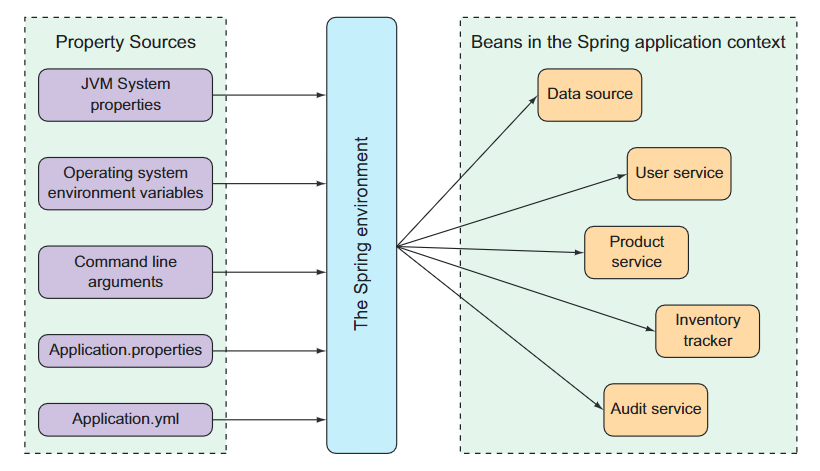

## Foundation

SpringFramework was introduced in Rod Johnson’s book, Expert One-on-One J2EE Designand Development

The `@Configuration` annotation indicates to Spring that this is a configuration classthat will provide beans to the Spring application context.

`@Bean` indicating that the objects they return should be addedas beans in the application context (where, by default, their respective bean IDs willbe the same as the names of the methods that define them)

`spring-boot-starter-parent` as its parentPOM. Among other things, this parent POM provides dependency management forseveral libraries commonly used in Spring projects.

`@WebMvcTest` is a special test annotation provided by Spring Boot that arranges for the test to run inthe context of a Spring MVC application

Spring boot DevTools:

-   Automatic application restart when code changes
-   Automatic browser refresh when browser-destined resource change
-   Automatic disable of template caches
-   Built in H2 Console if the H2 database is in use

### Spring MVC

To apply validation in Spring MVC, you need to:

-   Declare validation rules on the class that is to be validated
-   Specify that validation should be performed in the controller methods thatrequire validation
-   Modify the form views to display validation errors

To validate a domain, you need to add the Java Bean Validation API's `@Valid` annatation

Thymeleaf offers convenient access to the Errors object via the fields property andwith its th:errors attribute.

By default, templates are only parsed once, when they’re first used, and the resultsof that parse are cached for subsequent use.

### Spring Data

wo ways to save data with JdbcTemplate include the following:

-   irectly, using the `update()` method
-   sing the `SimpleJdbcInsert` wrapper classListing

The `update()` method,used when saving ingredient data, doesn’t help you get at the generated ID

The `update()` method you need accepts a `PreparedStatementCreator` and a `Key-Holder`. It’s the `KeyHolder` that will provide the generated taco ID. But in order to useit, you must also create a `PreparedStatementCreator`

JPA requires that entities have a no-arguments constructor

### Spring Security

By doing nothing more than adding the security starter to the project build, youget the following security features:

-   All HTTP request paths require authentication
-   No specific roles or authorities are required
-   There’s no login page
-   Authentication is prompted with HTTP basic authentication
-   There’s only one user; the username is user

Spring Security offers several options for configuring a user store,including these:

-   An in-memory user store
-   A JDBC-based user store
-   An LDAP-backed user store
-   A custom user details service

`UserDetailsService`'s `loadByUsername()` method has one simple rule: it must never return null.

有关用户配置信息的配置类位于`WebSercurityConfigurerAdater`中

Among the many things you can con-figure with HttpSecurity are these：

-   Requiring that certain security conditions be met before allowing a request tobe served
-   Configuring a custom login page
-   Enabling users to log out of the application
-   Configuring cross-site request forgery protection

The `and()` method signifies that you’refinished with the authorization configuration and are ready to apply some addi-tional HTTP configuration.

By default, Spring Security listens for login requests at `/login` and expects that the username and password fields be named `username` and `password`.

Spring Security listen for requests to `/authenticate` to handle login submissions.

There are several ways to determine who the user is. These are a few of the mostcommon ways:

-   Inject a `Principal` object into the controller method
-   Inject an `Authentication` object into the controller method
-   Use `SecurityContextHolder` to get at the security context
-   Use an `@AuthenticationPrincipal` annotated method

### Configuration properties

It’s important to establishthat there are two different (but related) kinds of configurations in Spring:

-   Bean wiring
-   Property injection

The Spring environment abstraction is a one-stop shop for any configurable property.

The Spring environment pulls from several propertysources, including:

-   JVM system properties
-   Operation system environment variables
-   Command-line arguments
-   Application property configuration files

To support property injection of configuration properties, Spring Boot providesthe @ConfigurationProperties annotation. When placed on any Spring bean, itspecifies that the properties of that bean can be injected from properties in theSpring environment.

the `@Profile` annotation can designate beans as onlybeing applicable to a given profile
