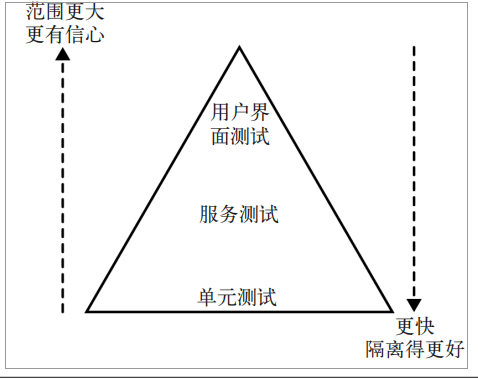
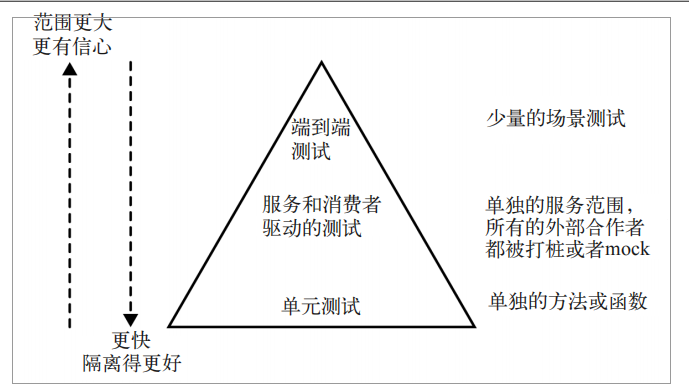

*如何寻找平衡*

## 第一章

### 微服务定义

1. 很小，专注于做好一件事情
    * 内聚性是指将相关代码放在一起
    * 根据业务大边界来确定服务大边界
    * 服务能够和团队相匹配
2. 自治性

### 微服务大好处

1. 技术异构性
2. 弹性
3. 扩展
4. 简化部署
5. 与组织结构相匹配
6. 可组合性
7. 对可替代性大优化

服务与服务之间可以并且应该大量使用第三方库来重用公共代码，但有时候效果不太好

## 第二章

人们试图通过大量的图表和文档创建出一个完美的方案，而忽略了很多基础性的未知因素

#### 一个原则性的方法

1. 战略目标
2. 原则
3. 实践：实践应该巩固原则
4. 将原则和实践相结合

日志功能和监控功能都需要集中式管理

一个运行异常的服务可能会毁了整个系统，所以必须保证每个服务都可以应对下游服务的错误请求

对以下几种请求做不同的处理可以帮助系统及时失败，并且也很容易追溯问题：

1. 正常且被正确处理大请求
2. 错误请求，并且服务识别出了它是错误的，但什么都没做
3. 被房屋的服务宕机了，所以无法判断请求是否正常

**治理**通过评估干系人的需求、当前情况及下一步的可能性来确保企业目标的达成，通过排优先级和做决策来设定方向。对于已经达成一致的方向和目标进行监督。

### 演进式架构师应该承担的职责

* 愿景
* 同理心
* 合作
* 适应性
* 自治性
* 治理

## 第三章

当考虑微服务的边界时，首先考虑比较大的、粗粒度的那些上下文，然后当发现合适的缝隙后，再进一步划分出那些嵌套的上下文。

修改系统的目的是为了满足业务需求

## 第四章

### 理想大集成技术

1. 避免破坏性修改
2. 保证 API 的技术无关性
3. 服务易于消费方使用
4. 隐藏内部实现细节

`PRC`的核心思想是隐藏远程调用大复杂性。

使用`RPC`需要注意不要对远程调用过度抽象，以至于网络因素完全被隐藏起来；确保可以独立大升级服务端接口而不用强迫客户端升级，所以在编写客户端代码时要注意这方面大平衡；在客户端中一定不要隐藏我们是在做网络调用这个事实。

尽量让中间件保持简单，而把业务逻辑放在自己的服务中

在微服务内部不要违反 DRY，但在跨服务的情况下可以适当违反 DRY

想要使用客户端库，一定要保证其中只包含处理底层传输协议的代码

### 版本管理

1. 尽可能推迟
2. 及早发现破坏性修改
3. 使用语义化的版本管理
4. 不同大接口共存
5. 同时使用多个版本的服务

最大程度地保证微服务之间的低耦合：

* 无论如何避免数据库集成
* 理解 REST 和 RPC 之间的取舍，但总是使用 REST 作为请求 / 响应模式的起点
* 相比编排，优先选择协同
* 避免破坏性修改、理解 Postel 法则、使用容错性读取器
* 将用户界面视为一个组合层

## 第五章

限界上下文就是一个非常好的接缝，因为它的定义就是组织内高内聚和低耦合的边界

### 部署

是否理解 CI 的三个问题：

* 是否每天签入代码到主线
* 是否有一组测试来验证修改
* 当构建失败后，团队是否把修复 CI 当作第一优先级的事情来做

使用 OS 特定构建物的好处是，在做部署时不需要考虑底层使用的是什么技术。只需要简单使用内置的工具就可以完成软件的安装

_

### 测试分类

1. 单元测试
2. 服务测试
3. 端到端测试

测试场景，而是故事（scrum 中的 stroy）

## 第八章 监控

对每个服务而言：

* 最低限度要跟踪请求响应时间。做好之后，可以开始跟踪错误率及应用程序级的指标。
* 最低限度要跟踪所有下游服务的健康状态，包括下游调用的响应时间，最好能够跟踪错误率。一些像 Hystrix 这样的库，可以在这方面提供帮助。
* 标准化如何收集指标以及存储指标。
* 如果可能的话，以标准的格式将日志记录到一个标准的位置。如果每个服务各自使用不同的方式，聚合会非常痛苦！
* 监控底层操作系统，这样你就可以跟踪流氓进程和进行容量规划。

对系统而言：

* 聚合 CPU 之类的主机层级的指标及应用程序级指标。
* 确保你选用的指标存储工具可以在系统和服务级别做聚合，同时也允许你查看单台主机的情况。
* 确保指标存储工具允许你维护数据足够长的时间，以了解你的系统的趋势。
* 使用单个可查询工具来对日志进行聚合和存储。
* 强烈考虑标准化关联标识的使用。
* 了解什么样的情况需要行动，并根据这些信息构造相应的警报和仪表盘。
* 调查对各种指标聚合方式做统一化的可能性，像 Suro 或 Riemann 这样的工具可能会对 你有用。
