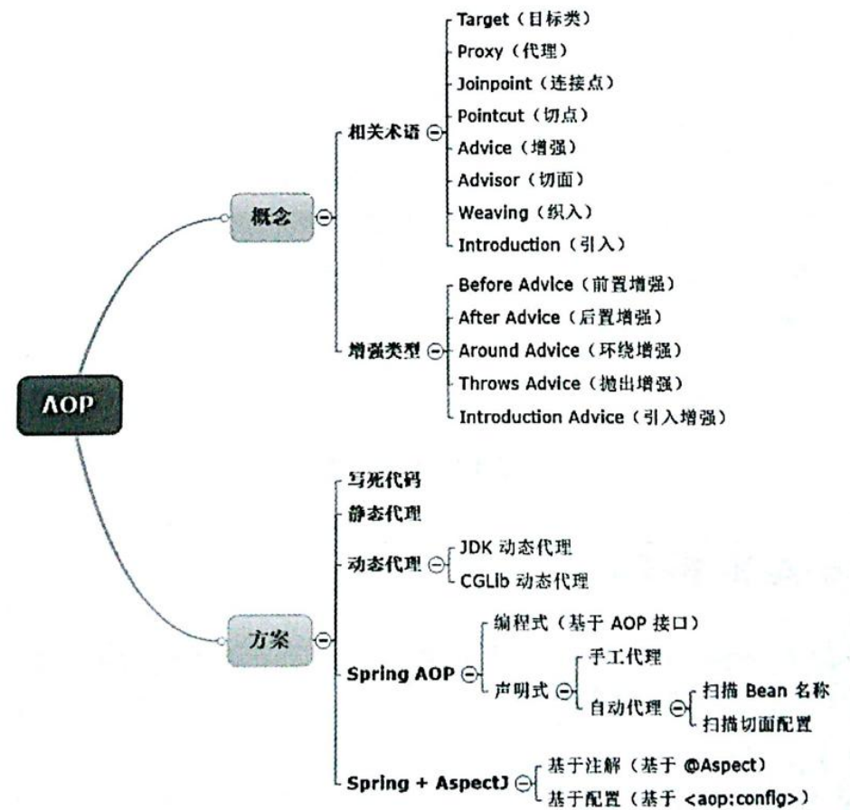
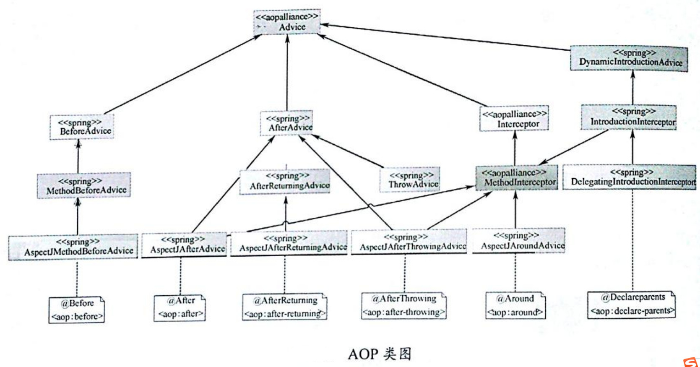

# 第一章

使用Servlet3.0框架是可以省略web.xml文件的，因为Servlet无须在web.xml里配置，只需通过Java注解的方式来配置即可

Maven说明：

1. Maven依赖的“三坐标”（groupId,artifactId,version)必须提供
2. 如果某些依赖只需参与编译，而无须打包，可将其scope设置为provided
3. 如果某些依赖只是运行时需要，但无须参与编译，可将其scope设置为runtime

# 第二章 为web应用添加业务功能

先从原始需求进行分析，找出需求中设计的用例，然后设计表结构，画原型图，定义URL规范

关于表结构，有如下建议：

1. 建议表名与字段名均为小写，若多个单词可以“下划线”分割；
2. 建议每张表都有唯一的主键字段，且字段名都为id，可使用自增主键；
3. 数据类型尽可能统一，不要出现太多的数据类型

在设计阶段里一帮不涉及任何的编码工作，写这些设计文档是为了让我们的思路更加清晰，也给我们的后续的开发工作提供帮助

在Servlet中，请求类型有GET、POST、PUT、DELETE，它们分别对应doGet、doPost、doPut、doDelete方法

在标准的MVC架构中是没有服务层的，我们将该层作为衔接控制层与数据库之间的桥梁，可以使用接口和实现类来表达，在简单情况下，无须使用接口，直接用类就可以了。并非在所有情况下都需要定义一个接口，要根据实际情况来做出选择

推荐将jsp放到WEB-INF内部，而并非外部，因为用户无法通过浏览器地址栏直接请求放在内部的jsp，必须通过Servlet程序进行转发（forward）或重定向（redirect）

在Apache Common项目中又一款名为DbUtils的类库，为我们提供了一个JDBC的封装。

使用DbUtils提供的QueryRunner对象可以面向实体（Entity）进行查询。实际上，DbUtils首先执行SQL语句并返回一个ResultSet，随后通过反射去创建并初始化实体对象。

为了确保一个线程中只有一个Connection，我们可以使用ThreadLocal来存放本地线程变量。将当前线程中的Connection放入ThreadLocal中存起来，这些Connection一定不会出现线程不安全问题，可以将ThreadLocal理解为一个隔离线程的容器

DbUtils提供的Handle：

* BeanHandler——返回Bean对象
* BeanListHandler——返回List对象
* BeanMapHandler——返回Map对象
* ArrayHandler——返回Object[]对象
* ArrayListHandler——返回List对象
* MapHandler——返回Map对象
* MapListHandler——返回List对象
* ScalarHandler——返回某列的值
* ColumnListHandler——返回某列的值列表
* KeyedHandler——返回Map对象，需要指定列名

层次结构如图所示： 

频繁的创建数据库连接，这样一定会造成大量的系统开销，毕竟数据库的连接数是有限度 。因此，将这些数据库连接进行“池化”，也就数需要一个数据库连接池。Apache DBCP是最好的数据库连接池之一

我们使用Apache DHCP的org.apache.commons.dbcp2.BasicDataSource来获取数据库的连接，只需要保证该对象是静态的就行了。

此外，为了使测试数据库与开放数据库分离，也就是说，应该是两个数据库，只是表结构相同而已。我们需要为单元测试单独创建一个数据库。

# 三 搭建轻量级Java Web框架

加载类需要提供类名与是否初始化的标志，这里提到的初始化指是否执行类的静态代码块。

获取指定包名下的所有类，我们需要根据包名并将其转换为文件路径，读取class文件或jar包，获取指定的类名去加载类。

不是开发者自己通过new的方式来实例化，而是通过框架自身来实例化，像这类实例化过程，称为IoC（Inversion of Control，控制反转）。控制不是由开发者决定的，而是反转给框架了。一般地，我们也将控制反转称为DI（Dependency Injection，依赖注入），可以理解为将某个类需要依赖的成员注入到这个类中

需要通过一个入口程序来加载静态块

由于视图中是可以包含数据模型的，因此在View中包括了视图路径和该视图中所需的模型数据，该模型数据是一个Map类型的“键值对”，可在视图中根据模型的键名获取键值。

# 四 是框架具备AOP特性

CGLib给我们提供的是方法级别的代理，也可以理解为对方法符拦截

代码只关注业务逻辑，而将配置放入文件中，这是一条最佳实践

CGLib创建代理的速度比较慢，但创建代理后运行的速度却非常快，而JDK动态代理正好相反。一般在系统初始化的时候用CGLib去创建代理，并放入Spring的ApplicationContext中以备后用

链式代理，也就是说，可以将多个代理通过一条链子串起来，一个个地执行，执行顺序取决于添加到链上的先后顺序

ThreadLocal是一个容器，用于存放线程的局部变量

ThreadLocalAPI：

* `public void set(T value)`：将值放入线程局部变量中；
* `public T get()`：从线程局部变量中获取值；
* `public void remove()`：从线程局部变量中移除值（有助于JVM垃圾回收）；
* `protected T initialValue()`：返回线程局部变量中的初始值（默认为null）

通过ThreadLocal存放JDBC Connection，以达到事务控制的能力

要使每个线程都拥有自己的连接，而不是共享同一个连接，否则“线程1”有可能会关闭“线程2”的连接，所以“线程2”就会报错

事物必须是一个不可分割的整体

事务还需要有一个一致性

我们必须保证数据库操作之间是“隔离”的（线程之间有时也要做到隔离），彼此之间没有任何干扰，这就是隔离性

原子性是基础，隔离性是手段，持久性是目的，真正的“老大”是一直型

与事物读取相关的操作：

* 脏读——事物A读取事物B未提交的数据，并在这个基础上又做了其他的事
* 不可重复读——事物A读取了事物B已提交的更改数据
* 幻读——事物A读取了事务B已提交更新的新增数据

# 第五章

框架的实现细节也许比较复杂，但框架的创建者一定要站在使用者的角度，尽可能地简化框架的使用方法。注重细节并且不断优化，这是每个框架创建者的职责

