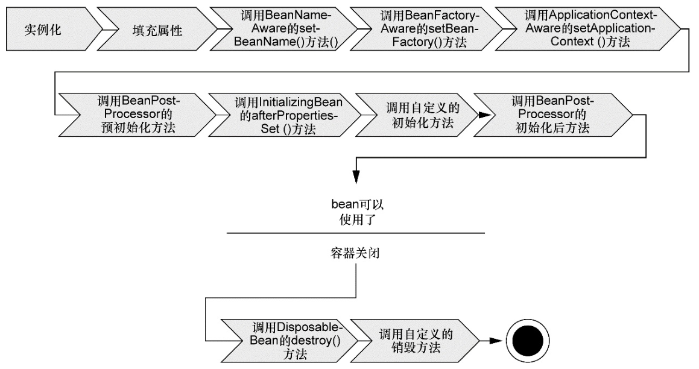
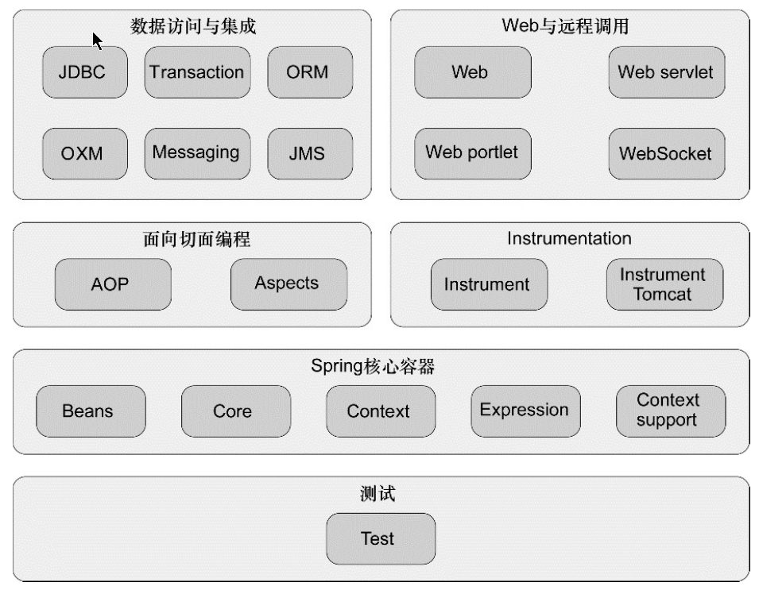
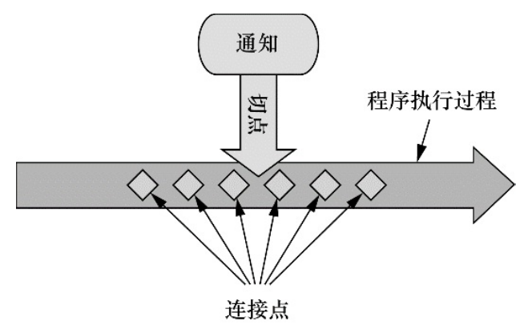
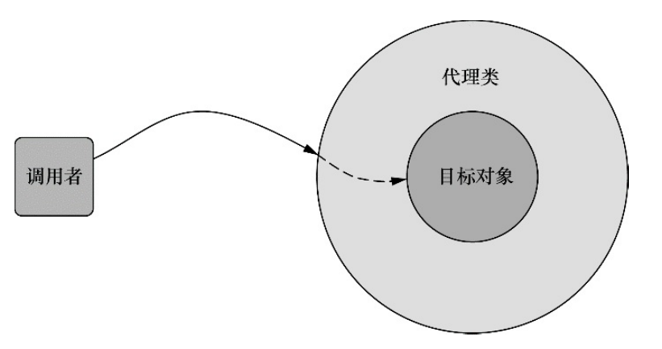
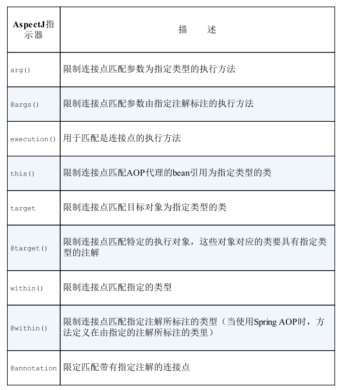
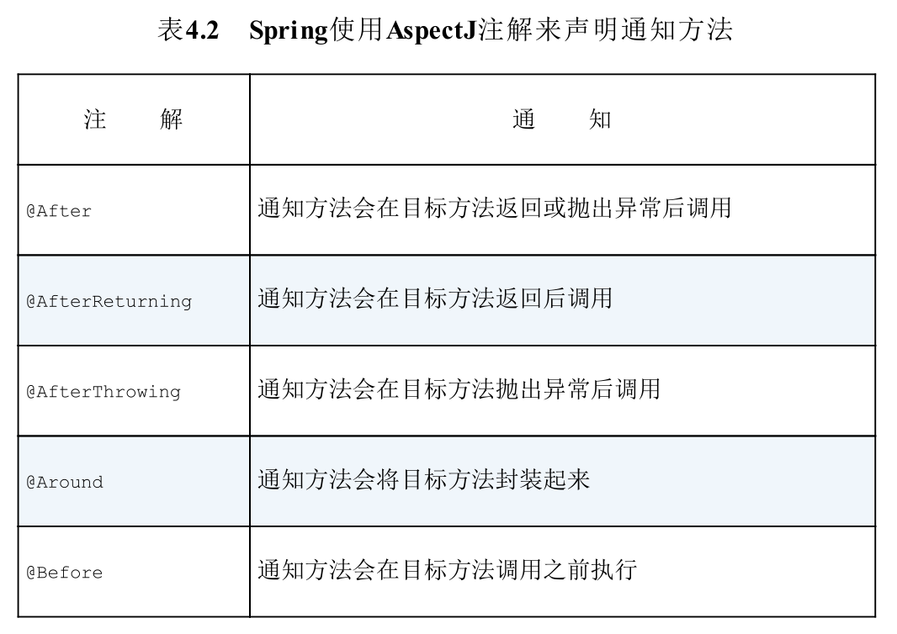
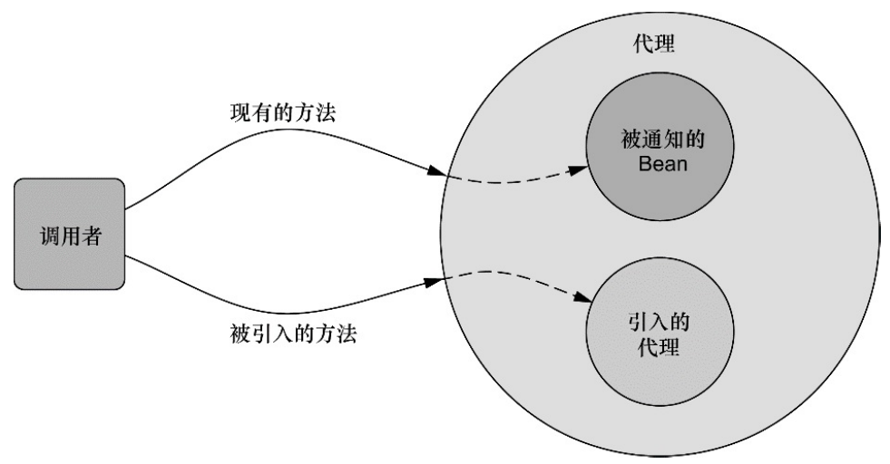
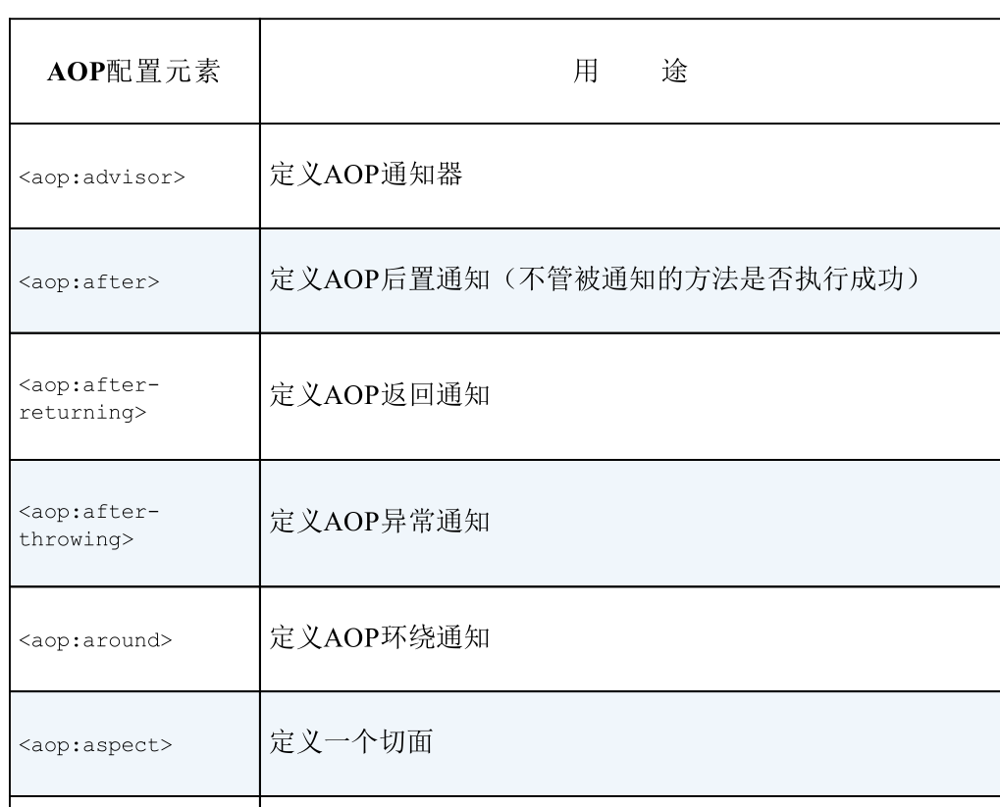
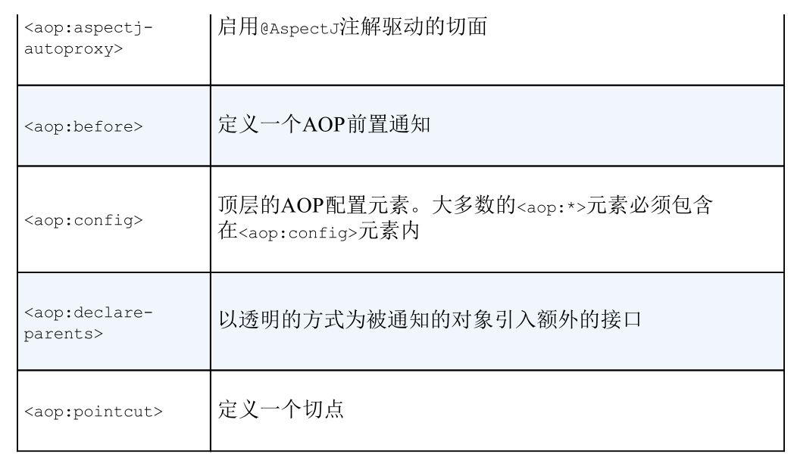
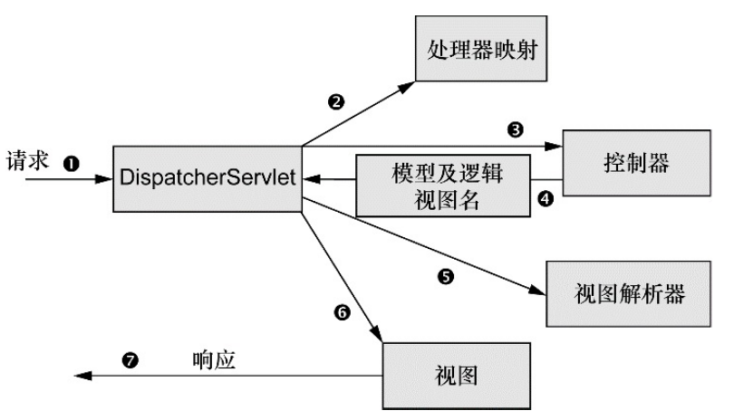

# 第一章

## 基础

降低Java开发的复杂性，Spring采取的策略：

* 基于POJO的轻量级和最小侵入性编程
* 通过依赖注入和面向接口实现松耦合
* 基于切面和惯例进行声明式编程
* 通过切面和模板减少样板式代码

耦合具有两面性：

1. 紧密的耦合代码难以测试、难以复用、难以理解，并且典型地表兄出“打地鼠”式的bug特性
2. 一定程度的耦合又是必须的——完全没有耦合的代码什么也做不了

### DI

Spring通过Application Context装载bean的定义并把它们组装起来。Spring应用上下文全权负责对象的创建和组装。

### AOP

AOP往往被定义为促使软件系统实现关注点的分离的一项技术。AOP能够使这些服务区模块化，并以声明 的方式将他们的应用到他们需要影响的组件中去。所造成的结果就是这些组件会具有更高的内聚性并且会更加关注自身的业务，完全不需要了解涉及系统服务所带来的复杂性。

`<aop:aspect>`元素引用该bean，前置调用为`<aop:before>`，后置调用为`<aop:after>`

## Spring容器

spring自带多个容器的实现，可以分为两种不同的类型bean工厂（由org.springframework. beans.
factory.eanFactory接口定义）是最简单的容器，提供基本的DI支持。应用上下文
（由org.springframework.context.ApplicationContext接口定义）基于BeanFactory构建，并提供应用框架级别的服务

Spring自带了多种类型的应用上下文。下面罗列的几个是你最有可能


* AnnotationConfigApplicationContext：从一个或多个基于Java的配置类中加载Spring应用上下文。
* AnnotationConfigWebApplicationContext：从一个或多个基于Java的配置类中加载Spring Web应用上下文。
* ClassPathXmlApplicationContext：从类路径下的一个或多个XML配置文件中加载上下文定义，把应用上下文的定义文件作为类资源。
* FileSystemXmlapplicationcontext：从文件系统下的一个或多个XML配置文件中加载上下文定义。
* XmlWebApplicationContext：从Web应用下的一个或多个XML配置文件中加载上下文定义。

Spring Bean的生命周期：






# 第二章

Spring提供了三种主要的装配机制：

* 在XML中进行显式配置。
* 在Java中进行显式配置。
* 隐式的bean发现机制和自动装配

## 自动化配置

Spring从两个角度来实现自动化装配：

* 组件扫描（component scanning）：Spring会自动发现应用上下文中所创建的bean。
* 自动装配（autowiring）：Spring自动满足bean之间的依赖

使用了`@Component`注解。这个简单的注解表明该类会作为组件类，并告知Spring要为这个类创建bean

`@ComponentScan`注解启用了组件扫描，这个注解能够在Spring中启用组件扫描,默认会扫描与配置类相同的包

使用XML来启用组件扫描的话，那么可以使用Spring context命名空间的`<context:component-scan>`元素

Spring应用上下文中所有的bean都会给定一个ID，Spring会根据类名为其指定一个ID。具体来讲就是将类名的第一个字母变为小写。如果想为这个bean设置不同的ID，你所要做的就是将期望的ID作为值传递给@Component注解。

Spring支持将`@Named`作为`@Component`注解的替代方案。两者之间有一些细微的差异，但是在大多数场景中，它们是可以互相替换的。

有一个原因会促使我们明确地设置基础包，那就是我们想要将配置类放在单独的包中，使其与其他的应用代码区分开来，为了指定不同的基础包，需要做的就是在`@ComponentScan`的value属性中指明包的名称.

除了将包设置为简单的String类型之外，`@ComponentScan`还提供了另外一种方法，那就是将其指定为包中所包含的类或接口

为了声明要进行自动装配，可以借助Spring的`@Autowired`注解。如果没有匹配的bean，那么在应用上下文创建的时候，Spring会抛出一个异常。为了避免异常的出现，你可以将`@Autowired`的required属性设置为`false`

将required属性设置为false时，Spring会尝试执行自动装配，但是如果没有匹配的bean的话，Spring将会让这个bean处于未装配的状态。但是，把required属性设置为false时，你需要谨慎对待。如果在你的代码中没有进null检查的话，这个处于未装配状态的属性有可能会出现NullPointerException

`@Autowired`是Spring的特有注解，可以替换为`@Inject`

## 通过java代码转配bean

JavaConfig是配置代码，这意味着它不应该包含任何业务逻辑，JavaConfig也不应该侵入到业务逻辑代码之中。尽管不是必须的，但通常会将JavaConfig放到单独的包中，使它与其他的应用程序逻辑分离开来，这样对于它的意图就不会产生困惑了。

创建JavaConfig类的关键在于为其添加`@Configuration`注解，`@Configuration`注解表明这个类是一个配置类，该类应该包含在Spring应用上下文中如何创建bean的细节

要在JavaConfig中声明bean，我们需要编写一个方法，这个方法会创建所需类型的实例，然后给这个方法添加`@Bean`注解.默认情况下，bean的ID与带有@Bean注解的方法名是一样的，但是可以使用name属性指定一个不同的名字。

在JavaConfig中装配bean的最简单方式就是引用创建bean的方法。

但是，在软件领域中，我们完全可以将同一个实例注入到任意数量的其他bean之中。默认情况下，Spring中的bean都是单例的。

**带有@Bean注解的方法可以采用任何必要的Java功能来产生bean实例**

## 通过XML装配bean

最简单的Spring XML配置：

```xml
<?xml version="1.0" encoding="UTF-8"?>
<beans xmlns="http://www.springframework.org/schema/beans"
  xmlns:xsi="http://www.w3.org/2001/XMLSchema-instance"
  xmlns:c="http://www.springframework.org/schema/c"
  xsi:schemaLocation="http://www.springframework.org/schema/beans http://www.springframework.org/schema/beans/spring-beans.xsd">
  
  <!--其余代码-->
  
</beans>
```

要在基于XML的Spring配置中声明一个bean，我们要使用spring-beans模式中的另外一个素：`<bean>`。`<bean>`元素类似于JavaConfig中的`@Bean`注解

作为替代的方案，你也可以使用Spring的c-命名空间。c-命名空间是在Spring 3.0中引入的，它是在XML中更为简洁地描述构造器参数的方式。要使用它的话，必须要在XML的顶部声明其模式

XML不允许某个元素的多个属性具有相同的名字。

`<list>`元素是`<constructor-arg>`的子元素，这表明一个包含值的列表将会传递到构造器中。其中，`<value>`元素用来指定列表中的每个元素。可以使用`<ref>`元素替代`<value>`，实现bean引用列表的装配。

Spring为`<constructor-arg>`元素提供了c-命名空间作为替代方案，与之类似，Spring提供了更加简洁的p-命名空间，作为`<property>`元素的替代方案

util-命名空间所提供的功能之一就是`<util:list>`元素，它会创建一个列表的bean。

在使用了XML的配置之后，如果要让spring同时加载它和其他基于Java的配置可以使用`@ImportResource`注解

在XML中，我们可以使用import元素来拆分XML配置

Spring中装配bean的三种主要方式：自动化配置、基于Java的显式配置以及基于XML的显式配置。

# 第三章 

## 环境与profile

使用EmbeddedDatabaseBuilder会搭建一个嵌入式的Hypersonic数据库，它的模式（schema）定义在schema.sql中，测试数据则是通过test-data.sql加载的。

通过JNDI获取DataSource能够让容器决定该如何创建这个DataSource，甚至包括切换为容器管理的连接池。

Spring引入了bean profile的功能。要使用profile，你首先要将所有不同的bean定义整理到一个或多个profile之中，在将应用部署到每个环境时，要确保对应的profile处于激活（active）的状态。在Java配置中，可以使用`@Profile`注解指定某个bean属于哪一个profile。

尽管每个DataSource bean都被声明在一个profile中，并且只有当规定的profile激活时，相应的bean才会被创
建，但是可能会有其他的bean并没有声明在一个给定的profile范围内。没有指定profile的bean始终都会被创建，与激活哪个profile没有关系。

我们也可以通过`<beans>`元素的profile属性，在XML中配置profile bean。重复使用元素来指定多个profile

Spring在确定哪个profile处于激活状态时，需要依赖两个独立的属性：spring.profiles.active和spring.profiles.default。如果设置了spring.profiles.active属性的话，那么它的值就会用来确定哪个profile是激活的。但如果没有设置spring.profiles.active属性的话，那Spring将会查找spring.profiles.default的值。如果spring.profiles.active和spring.profiles.default均没有设置的话，那就没有激活的profile，因此只会创建那些没有定义在profile中的bean。

有多种方式来设置这两个属性：

* 作为DispatcherServlet的初始化参数；
* 作为Web应用的上下文参数；
* 作为JNDI条目；
* 作为环境变量；
* 作为JVM的系统属性；
* 在集成测试类上，使用@ActiveProfiles注解设置。

Spring提供了`@ActiveProfiles`注解，我们可以使用它来指定运行测试时要激活哪个profile。

## 条件话Bean

Spring 4引入了一个新的@Conditional注解，它可以用到带有@Bean注解的方法上。如果给定的条件计算结果为true，就会创建这个bean，否则的话，这个bean会被忽略。

通过ConditionContext，我们可以做到如下几点：
* 借助getRegistry()返回的BeanDefinitionRegistry检查bean定义；
  借助getBeanFactory()返回的

* ConfigurableListableBeanFactory检查bean是否存在，甚至探查bean的属性；

  借助getEnvironment()返回的Environment检查环境变量是否存在以及它的值是什么；

* 读取并探查getResourceLoader()返回的ResourceLoader所加载的资源；

* 借助getClassLoader()返回的ClassLoader加载并检查类是否存在。

从Spring 4开始，@Profile注解进行了重构，使其基于@Conditional和Condition实现

@Profile本身也使用了@Conditional注解，并且引用ProfileCondition作为Condition实现

## 处理自动装配的歧义性

可以将可选bean中的某一个设为首选（primary）的bean，或者使用限定符（qualifier）来帮助Spring将可选的bean的范围缩小到只有一个bean。

可以将可选bean中的某一个设为首选（primary）的bean，或者使用限定符（qualifier）来帮助Spring将可选的bean的范围缩小到只有一个bean。

`@Primary`能够与`@Component`组合用在组件扫描的bean上，也可以与`@Bean`组合用在Java配置的bean声明中。

设置首选bean的局限性在于@Primary无法将可选方案的范围限定到唯一一个无歧义性的选项中。它只能标示一个优先的可选方案。当首选bean的数量超过一个时，我们并没有其他的方法进一步缩小可选范围。与之相反，Spring的限定符能够在所有可选的bean上进行缩小范围的操作，最终能够达到只有一个bean满足所规定的限制条件。如果将所有的限定符都用上后依然存在歧义性，那么你可以继续使用更多的限定符来缩小选择范围。`@Qualifier`注解是使用限定符的主要方式。

Java不允许在同一个条目上重复出现相同类型的多个注解

## Bean的作用域

在默认情况下，Spring应用上下文中所有bean都是作为以单例（singleton）的形式创建的。

Spring定义了多种作用域，可以基于这些作用域创建bean，包括：

* 单例（Singleton）：在整个应用中，只创建bean的一个实例。
* 原型（Prototype）：每次注入或者通过Spring应用上下文获取的时候，都会创建一个新的bean实例。
* 会话（Session）：在Web应用中，为每个会话创建一个bean实例。
* 请求（Rquest）：在Web应用中，为每个请求创建一个bean实例。

如果你想在Java配置中将Notepad声明为原型bean，那么可以组合使用@Scope和@Bean来指定所需的作用域：

```java
@Bean
@Scope(configurableBeanFactory.SCOPE_PROTOTYPE)
```

我们将value设置成了WebApplicationContext中的SCOPE_SESSION常量（它的值是session）。这会告诉Spring为Web应用中的每个会话创建一个ShoppingCart。这会创建多个bean的实例，但是对于给定的会话只会创建一个实例，在当前会话相关的操作中，这个bean实际上相当于单例的

```java
@Component
@Scope(value=WebApplicationContext.SCOPE_SESSION,
      proxyMode=ScopedProxyMode.INTERFACES)
```

@Scope同时还有一个proxyMode属性，它被设置成了ScopedProxyMode.INTERFACES。这个属性解决了将会话或请求作用域的bean注入到单例bean中所遇到的问题

## 运行时值注入

有时候硬编码是可以的，但有的时候，我们可能会希望避免硬编码值，而是想让这些值在运行时再确定。为了实现这些功能，Spring提供了两种在运行时求值的方式：

* 属性占位符（Property placeholder）。
* Spring表达式语言（SpEL）。

在Spring中，处理外部值的最简单方式就是声明属性源并通过Spring的Environment来检索属性。

Environment还提供了几个与属性相关的方法，如果你在使用getProperty()方法的时候没有指定默认值，并且这个属性没有定义的话，获取到的值是null。如果你希望这个属性必须要定义，那么可以使用getRequiredProperty()方法

Spring也提供了通过占位符装配属性的方法，这些占位符的值会来源于一个属性源。

在XML配置没有使用任何硬编码的值，它的值是从配置文件以外的一个源中解析得到的。如果我们依赖于组件扫描和自动装配来创建和初始化应用组件的话，那么就没有指定占位符的配置文件或类了。

推荐使用PropertySourcesPlaceholderConfigurer，因为它能够基于Spring Environment及其属性源来解析占位符。

解析外部属性能够将值的处理推迟到运行时，但是它的关注点在于根据名称解析来自于Spring Environment和属性源的属性。

SpEL拥有很多特性，包括：

* 使用bean的ID来引用bean；
* 调用方法和访问对象的属性；
* 对值进行算术、关系和逻辑运算；
* 正则表达式匹配；
* 集合操作。

**SpEL表达式要放到“#{ ... }”之中**

SpEL表达式也可以引用其他的bean或其他bean的属性，通过systemProperties对象引用系统属性。

在XML配置中，你可以将SpEL表达式传入`<property>`或`<constructor-arg>`的value属性中，或者将其作为p-命名空间或c-命名空间条目的值

**SpEL可以表示字面值，引用bean、属性和方法，在表达式中使用类型，计算正则表达式，计算集合**

如果要在SpEL中访问类作用域的方法和常量的话，要依赖T()这个关键的运算符。如果要在SpEL中访问类作用域的方法和常量的话，要依赖T()这个关键的运算符。

SpELl运算符：


比较运算符有两种形式：符号形式和文本形式。在大多数情况下，符号运算符与对应的文本运算符作用是相同的。

比较运算符有两种形式：符号形式和文本形式。在大多数情况下，符号运算符与对应的文本运算符作用是相同的。

SpEL通过matches运算符支持表达式中的模式匹配。matches运算符对String类型的文本（作为左边参数）应用正则表达式（作为右边参数）。matches的运算结果会返回一个Boolean类型的值：如果与正则表达式相匹配，则返回true；否则返回false。

选择运算符在它的方括号中接受另一个表达式。

SpEL还提供了另外两个查询运算符：“.^[]”和“.$[]”，它们分别用来在集合中查询第一个匹配项和最后一个匹配项

**在动态注入值到Spring bean时，SpEL是一种很便利和强大的方式。我们有时会忍不住编写很复杂的表达式。但需要注意的是，不要让你的表达式太智能。你的表达式越智能，对它的测试就越重要。SpEL毕竟只是String类型的值，可能测试起来很困难。鉴于这一点，我建议尽可能让表达式保持简洁，这样测试不会是什么大问题**

Java 8允许出现重复的注解，只要这个注解本身在定义的时候带有@Repeatable注解就可以。不过，Spring的@Qualifier注解并没有在定义时添加@Repeatable注解

# 第四章 面向切面的Spring

描述切面的常用术语有通知（advice）、切点（pointcut）和连接点（join point）



Spring切面可以应用5种类型的通知：

* 前置通知（Before）：在目标方法被调用之前调用通知功能；
* 后置通知（After）：在目标方法完成之后调用通知，此时不会关心方法的输出是什么；
* 返回通知（After-returning）：在目标方法成功执行之后调用通知；
* 异常通知（After-throwing）：在目标方法抛出异常后调用通知；
* 环绕通知（Around）：通知包裹了被通知的方法，在被通知的方法调用之前和调用之后执行自定义的行为。

我们的应用可能也有数以千计的时机应用通知。这些时机被称为连接点。连接点是在应用执行过程中能够插入切面的一个点。这个点可以是调用方法时、抛出异常时、甚至修改一个字段时。切面代码可以利用这些点插入到应用的正常流程之中，并添加新的行为。

引入允许我们向现有的类添加新方法或属性。

织入是把切面应用到目标对象并创建新的代理对象的过程。切面在指定的连接点被织入到目标对象中。在目标对象的生命周期里有多个点可以进行织入：

* 编译期：切面在目标类编译时被织入。这种方式需要特殊的编译器。AspectJ的织入编译器就是以这种方式织入切面的。
* 类加载期：切面在目标类加载到JVM时被织入。这种方式需要特殊的类加载器（ClassLoader），它可以在目标类被引入应用之前增强该目标类的字节码。AspectJ 5的加载时织入（load-timeweaving，LTW）就支持以这种方式织入切面。
* 运行期：切面在应用运行的某个时刻被织入。一般情况下，在织入切面时，AOP容器会为目标对象动态地创建一个代理对象。Spring AOP就是以这种方式织入切面的。

通知包含了需要用于多个应用对象的横切行为；连接点是程序执行过程中能够应用通知的所有点；切点定义了通知被应用的具体位置（在哪些连接点）。其中关键的概念是切点定义了哪些连接点会得到通知。

Spring提供了4种类型的AOP支持：

* 基于代理的经典Spring AOP；
* 纯POJO切面；
* @AspectJ注解驱动的切面；
* 注入式AspectJ切面（适用于Spring各版本）

前三种都是Spring AOP实现的变体，Spring AOP构建在动态代理基础之上，因此，Spring对AOP的支持局限于方法拦截

引入了简单的声明式AOP和基于注解的AOP之后，Spring经典的AOP看起来就显得非常笨重和过于复杂，直接使用ProxyFactory Bean会让人感觉厌烦。

借助Spring的aop命名空间，我们可以将纯POJO转换为切面。实际上，这些POJO只是提供了满足切点条件时所要调用的方法。

借助Spring的aop命名空间，我们可以将纯POJO转换为切面。实际上，这些POJO只是提供了满足切点条件时所要调用的方法。



直到应用需要被代理的bean时，Spring才创建代理对象。如果使用的是ApplicationContext的话，在ApplicationContext从BeanFactory中加载所有bean的时候，Spring才会创建被代理的对象。因为Spring运行时才创建代理对象，所以我们不需要特殊的编译器来织入Spring AOP的切面。

**Spring只支持方法级别的连接点**

因为Spring基于动态代理，所以Spring只支持方法连接点。

**关于Spring AOP的AspectJ切点，最重要的一点就是Spring仅支持AspectJ切点指示器（pointcut designator）的一个子集。**





如果你使用JavaConfig的话，可以在配置类的类级别上通过使用EnableAspectJ-AutoProxy注解启用自动代理功能。

假如你在Spring中要使用XML来装配bean的话，那么需要使用Springaop命名空间中的`<aop:aspectj-autoproxy>`元素。

不管你是使用JavaConfig还是XML，AspectJ自动代理都会为使用@Aspect注解的bean创建一个代理，这个代理会围绕着所有该切面的切点所匹配的bean。

使用Spring AOP，我们可以为bean引入新的方法。代理拦截调用并委托给实现该方法的其他对象。



我们需要注意的是，当引入接口的方法被调用时，代理会把此调用委托给实现了新接口的某个其他对象。实际上，一个bean的实现被拆分到了多个类中。

@DeclareParents注解由三部分组成：

* value属性指定了哪种类型的bean要引入该接口。在本例中，也就是所有实现Performance的类型。（标记符后面的加号表示是Performance的所有子类型，而不是Performance本身。）
* defaultImpl属性指定了为引入功能提供实现的类。在这里，我们指定的是DefaultEncoreable提供实现。
* @DeclareParents注解所标注的静态属性指明了要引入了接口。在这里，我们所引入的是Encoreable接口。

当Spring发现一个bean使用了@Aspect注解时，Spring就会创建一个代理，然后将调用委托给被代理的bean或被引入的实现，这取决于调用的方法属于被代理的bean还是属于被引入的接口。

AOP的命名空间：





关于Spring AOP配置元素，第一个需要注意的事项是大多数的AOP配置元素必须在`<aop:config>`元素的上下文内使用。

使用环绕通知，我们可以完成前置通知和后置通知所实现的相同功能，而且只需要在一个方法中 实现。因为整个通知逻辑是在一个方法内实现的，所以不需要使用成员变量保存状态。

`<aop:declare-parents>`声明了此切面所通知的bean要在它的对象层次结构中拥有新的父类型。

当Spring AOP不能满足需求时，我们必须转向更为强大的AspectJ。

# 第五章 构建Spring Web应用程序

Spring MVC所经历的所有站点：



Spring提供了这个接口的实现，名为SpringServletContainerInitializer，这个类反过来又会查找实现WebApplicationInitializer的类并将配置的任务交给它们来完成。

当DispatcherServlet启动的时候，它会创建Spring应用上下文，并加载配置文件或配置类中所声明的bean。

要求DispatcherServlet加载应用上下文时，使用定义在WebConfig配置类（使用Java配置）中的bean。

但是在Spring Web应用中，通常还会一个应用上下文，
这个应用上下文是由ContextLoaderListener创建的。我们希望DispatcherServlet加载包含Web组件的bean，如控制器、视图解析器以及处理器映射，而ContextLoaderListener要加载应用中的其他bean。这些bean通常是驱动应用后端的中间层和数据层组件。